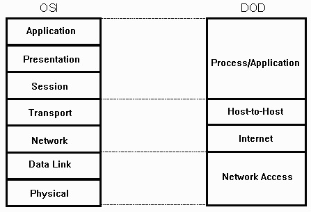

# Web infrastructure design

> **وَأَن لَّيْسَ لِلْإِنسَانِ إِلَّا مَا سَعَىٰ**
> 
# 🕸️Networking

## What is Network?

A network is essentially a system that connects two or more devices together for the purpose of sharing resources and information. These devices can be anything from computers and phones to printers and servers.

Here's a breakdown of what a network typically involves:

- **Connected Devices:** The core of a network is the collection of devices that are linked together. This can range from a small home network with a few devices to a large enterprise network with thousands of devices.
- **Communication Channels:** These channels, wired or wireless, allow the devices to transmit data and signals to each other. Wired connections use cables like ethernet, while wireless connections use radio waves or other technologies like Bluetooth or Wi-Fi.
- **Shared Resources:** Networks enable devices to share resources like files, printers, and internet access. This eliminates the need for each device to have its own copy of everything.
- **Communication Protocols:** These are essentially the rules that govern how devices communicate on the network. They define how data is formatted, transmitted, and received.

## Network Services

Network services are software programs that run on a network and provide specific functionalities to users and other devices. They typically reside on servers and operate at the application layer (layer 7) of the Open Systems Interconnection (OSI) model.

Here's a breakdown of network services:

- **`Functionalities`:** Network services offer a wide range of capabilities, including:
    - **Data Storage and Retrieval:** Services like file servers and databases allow storing, managing, and accessing data across the network.
    - **Communication and Collaboration:** Email, instant messaging, and video conferencing services enable communication and collaboration among users.
    - **Resource Sharing:** Printers, scanners, and other hardware resources can be shared efficiently across the network.
    - **Remote Access:** Services like SSH and remote desktop allow users to access and control computers remotely.
    - **Internet and Cloud Connectivity:** Network services provide access to the internet and cloud platforms, enabling various online applications and services.
- **`Implementation`:** Network services are often implemented using a client-server or peer-to-peer architecture.
    - **Client-Server:** In this model, a central server runs the service, and client devices on the network connect to the server to utilize its functionalities. (e.g., web server and web browser)
    - **Peer-to-Peer:** Devices on the network communicate directly with each other to share resources or functionalities. (e.g., file sharing applications like BitTorrent)
- **`Examples of Network Services`:** Here are some common network services you might encounter:
    - **Domain Name System (DNS):** Translates human-readable website names (like [invalid URL removed]) into numerical IP addresses that computers can understand.
    - **Dynamic Host Configuration Protocol (DHCP):** Assigns IP addresses to devices automatically when they connect to the network.
    - **File Transfer Protocol (FTP):** Enables transferring files between computers on a network.
    - **Hypertext Transfer Protocol (HTTP):** The foundation of web communication, allowing web browsers to access information from web servers.
    - **Simple Mail Transfer Protocol (SMTP):** The protocol used for sending emails.

Network services are essential components of modern computing, enabling communication, resource sharing, and access to various applications and information across a network.

## Network Components

Network components can be broadly categorized into two types: hardware and software.

**`Hardware Components`:**

These are the physical devices that make up the network infrastructure and enable communication between devices. Here are some key hardware components:

- **End Devices:** These are the devices that users interact with on the network, such as computers, laptops, smartphones, tablets, printers, servers, and network storage devices.
- **Network Interface Cards (NICs):** Also known as Ethernet cards, these are installed in each end device and allow it to connect to the network. They convert data from the device into electrical signals that can travel over the network media.
- **Connecting Devices:** These devices interconnect various components within the network and manage data flow. Some common examples include:
    - **`Switches`:** They provide dedicated connections between devices, improving network performance by reducing congestion.
    - **`Routers`:** These intelligent devices direct data packets across different networks, determining the optimal path for data to reach its destination. They are crucial for connecting multiple networks, like connecting your home network to the internet.
    - **`Hubs`:** These are simpler devices that broadcast data to all connected devices, which can be less efficient for larger networks compared to switches.
    - **`Wireless Access Points (WAPs)`:** These devices create wireless networks using Wi-Fi technology, allowing devices to connect to the network without cables.
- **Transmission Media:** This is the physical pathway through which data travels on the network. It can be wired or wireless:
    - **`Wired media`:** Includes cables like coaxial cables, twisted-pair cables (commonly used for ethernet), and fiber optic cables.
    - **`Wireless media`:** Uses radio waves to transmit data through the air. Wi-Fi, Bluetooth, and cellular networks are examples of wireless transmission media.

**`Software Components`:**

These are the programs that manage and control the network functionality. Here are some important software components:

- **Operating Systems (OS):** The operating system running on network devices like servers and routers manages network resources and communication protocols.
- **Network Protocols:** These are sets of rules that define how data is formatted, transmitted, and received on the network. Examples include TCP/IP (Transmission Control Protocol/Internet Protocol), the foundation of internet communication, and protocols specific to network services like FTP and HTTP.
- **Device Drivers:** These are software programs that allow the operating system to communicate with specific hardware components like NICs.
- **Network Management Software:** These tools assist network administrators in monitoring, configuring, and troubleshooting network performance and security.

The specific network components used will depend on the size, complexity, and purpose of the network. However, these basic categories provide a foundation for understanding how networks function.

## Types of Network Topology

Network topology refers to the way devices on a network are arranged and interconnected. It defines the overall structure of the network and influences factors like data flow, performance, scalability, and troubleshooting. Here are some common network topologies:

**1. Bus Topology**

In a bus topology, all devices are connected to a single central cable, similar to a bus route.  Data packets travel along the cable, and all devices on the network receive the signal. Each device has a unique address that allows it to identify the intended recipient of the data.

- **`Advantages`:** Simple to set up and implement, requires less cabling compared to some other topologies.
- **`Disadvantages`:** A single break in the cable can disrupt the entire network. Performance can be affected by network traffic as all devices share the same bandwidth. Troubleshooting can be more challenging due to the shared nature of the cable.

**2. Star Topology**

In a star topology, each device has a dedicated connection to a central hub or switch. This central device acts as a control point, managing data flow and communication between devices. Data packets are only sent to the intended recipient, improving network efficiency and reducing collisions.

- **`Advantages`:** More reliable compared to bus topology as a failure in one connection won't affect other devices. Easier to troubleshoot and isolate problems. Scalable by adding more devices to the central hub/switch.
- **`Disadvantages`:** Requires more cabling compared to bus topology. Relies on the central device, so a failure in the hub or switch can bring down the entire network.

**3. Ring Topology**

In a ring topology, devices are connected in a closed loop, forming a ring. Data packets travel in one direction around the ring, passing through each device until they reach their destination. Each device acts as a repeater, regenerating the signal to maintain its strength as it travels around the loop.

- **`Advantages`:** Can be more reliable than bus topology as data packets can continue to circulate even if one device fails.
- **`Disadvantages`:** A break in the cable or a failure in one device can disrupt the entire network. Adding or removing devices can disrupt network traffic.

**4. Mesh Topology**

In a mesh topology, devices are interconnected with multiple paths between them, forming a web-like structure. Data packets can take various routes to reach their destination, providing redundancy and fault tolerance. Mesh networks are often used in wireless networks where devices can connect to each other directly or through multiple hops.

- **`Advantages`:** Highly reliable and fault-tolerant as data can take alternate paths if one connection fails. Scalable and flexible as new devices can be easily added to the mesh.
- **`Disadvantages`:** More complex to set up and manage compared to simpler topologies. Can require more cabling or wireless access points depending on the implementation.

The choice of network topology depends on various factors like network size, budget, performance requirements, and desired level of redundancy.

### Resources

[Types of Network Topology - GeeksforGeeks](https://www.geeksforgeeks.org/types-of-network-topology/)

## WAN && MAN && LAN

WAN, MAN, and LAN are all acronyms used to describe different types of computer networks, categorized based on the area they cover.

- **LAN (Local Area Network)**: This is the smallest type of network, typically connecting devices in a close physical proximity like a home, school, or office building. LANs are known for their high speeds and ease of maintenance.
- **MAN (Metropolitan Area Network)**: A MAN covers a larger area than a LAN, often encompassing a city or a college campus. It can connect multiple LANs together. MANs are less common than LANs.
- **WAN (Wide Area Network)**: WANs are the largest type of network, spanning long distances and even connecting entire continents. The internet itself is a WAN. WANs typically have slower speeds than LANs due to the greater distances involved.

## Logical IP address vs Physical IP address

A logical IP address, also commonly referred to simply as an IP address, is an identifier assigned to a device on a network. It acts as a unique label that allows devices to communicate and locate each other across the network. Here's a breakdown of key points about logical IP addresses:

- **Function:** The primary function of an IP address is to identify and locate devices on a network. Think of it like a mailing address for your device on the digital highway.
- **Format:** IP addresses typically consist of four sets of numbers between 0 and 255, separated by periods (e.g., 192.168.1.1). This format is known as IPv4 (Internet Protocol version 4). A newer version, IPv6, uses eight groups of hexadecimal digits (e.g., fe80::200:5efe:feff:8001) to accommodate a much larger address space.
- **`Logical` vs. `Physical`:** IP addresses are considered logical addresses because they are assigned by software (Internet Protocol) and can be changed. This is in contrast to a device's MAC address, which is a unique hardware identifier burned into the network interface card (NIC) and is permanent.

Here are some additional characteristics of logical IP addresses:

- **Assignment:** IP addresses can be assigned statically (manually configured) or dynamically (assigned by a DHCP server) depending on the network configuration.
- **Types:** There are different types of IP addresses used for various purposes, such as public IP addresses (identifying devices on the internet) and private IP addresses (used within a local network).
- **Network and Host Identification:** An IP address typically consists of two parts: the network ID and the host ID. The network ID identifies the specific network to which a device belongs, while the host ID identifies the individual device within that network.

Understanding logical IP addresses is fundamental for anyone working with networks. They are the essential building blocks for enabling communication and data flow between devices on a network.

## **Address Grouping**

Address grouping in networking is a technique for managing a collection of IP addresses as a single unit. This simplifies tasks like applying network policies or access control rules to a group of devices. Here's how it relates to the concepts of broadcast, unicast, and multicast:

**Address Grouping:**

- **Function:** Address groups allow you to define a set of IP addresses that can be treated collectively. This can be helpful for managing access, security policies, or network configurations for multiple devices at once.
- **Implementation:** Grouping can be implemented using various methods depending on the specific network device or software. Common approaches include:
    - **`Network Address Translation (NAT)`:** Allows mapping a group of private IP addresses to a single public IP address.
    - **`Access Control Lists (ACLs)`:** Rules can be applied to an address group within ACLs, defining network access permissions for all devices in the group.
    - **`Security Groups`:** Cloud platforms and virtual environments often use security groups to manage network security policies for groups of virtual machines.

**Relationship to Broadcast, Unicast, and Multicast:**

- **Broadcast:** While not directly related to address grouping itself, broadcasts can be limited by using address groups. Network devices like switches can be configured to only forward broadcasts to specific groups of devices, reducing unnecessary traffic on the network.
- **Unicast:** Address grouping can be used to define the destination for unicast transmissions. For example, a network administrator might create a group for all web servers and configure firewall rules to allow incoming traffic from the internet only to that group.
- **Multicast:** Similar to unicast, address groups can be used to define the destination for multicast transmissions. Multicast allows sending data to a specific group of devices interested in receiving it, more efficiently than broadcast.

Here's a table summarizing the relationships:

| Feature | Broadcast | Unicast | Multicast | Address Grouping |
| --- | --- | --- | --- | --- |
| Transmission Type | One-to-All | One-to-One | One-to-Many | N/A |
| Address Groups | Can be used for limiting | Can be used for defining | Can be used for defining | Used to manage a collection |
|  | broadcast scope | destination | destination | of IP addresses |

By using address grouping effectively, network administrators can simplify network management, improve security, and optimize network traffic flow.

## **Network Efficiency**

Collision domain and broadcast domain are two key concepts related to data transmission and network efficiency. Here's a breakdown of each:

**Collision Domain:**

- **Definition:** A collision domain is a group of devices on a network that share a single wired segment. When two or more devices on the same collision domain attempt to transmit data simultaneously, a collision occurs. The data packets corrupt each other, and both devices need to wait and re-transmit. This can significantly reduce network performance.
- **Impact:** The size of the collision domain affects network performance. Larger collision domains with many devices are more prone to collisions, leading to slower data transfer speeds.
- **Examples of Devices in a Collision Domain:** All devices connected to a single hub are in the same collision domain. In a switch, each port can be considered a separate collision domain by default.

**Broadcast Domain:**

- **`Definition`:** A broadcast domain is a group of devices on a network that can see all broadcast traffic. When a device sends a broadcast message (intended for all devices), all devices within the same broadcast domain will receive and process that message, regardless of whether it's specifically meant for them.
- **`Impact`:** Excessive broadcasts can congest the network as all devices need to handle the traffic, even if it's not relevant to them.
- **Examples of Devices in a Broadcast Domain:** All devices connected to a single hub or switch are typically in the same broadcast domain. Routers segment broadcast domains, meaning devices on separate networks connected by a router won't receive broadcasts from each other's network.

**Key Differences:**

| Feature | Collision Domain | Broadcast Domain |
| --- | --- | --- |
| Focus | Data collisions | Broadcast messages |
| Impact | Affects speed | Affects congestion |
| Network Devices | Hubs | Hubs, Switches (default) |
| Segmentation | Limited | Routers segment broadcasts |

Here's an analogy to understand the difference:

- **Collision Domain:** Imagine a single-lane highway. If two cars try to enter the highway at the same time, they collide. This is similar to a collision on a network segment where data packets from two devices run into each other.
- **Broadcast Domain:** Imagine a neighborhood with a loudspeaker system. If someone makes an announcement through the loudspeaker, everyone in the neighborhood hears it, regardless of whether it's relevant to them. This is similar to a broadcast message on a network where all devices in the same broadcast domain receive it.

By understanding collision domains and broadcast domains, network administrators can design and configure networks for optimal performance and efficiency. Techniques like using switches and routers can help mitigate collisions and control broadcast traffic.

## Legacy Networking Protocols

`SNA`, `ATP`, and `IPX` are all networking terms related to protocols used in the past, primarily on Novell Netware networks, a once-dominant network operating system. While not as common today due to the rise of TCP/IP networks like Windows and Linux, understanding these terms can be helpful if you encounter older systems or historical networking references.

Here's a breakdown of each term:

- **SNA (Systems Network Architecture):**
    - Developed by IBM, SNA is a broad set of protocols and specifications for communication between computers in a centralized network.
    - It defines how data is formatted, transmitted, and managed across different hardware and software platforms.
    - While less prevalent today, SNA concepts can still be relevant in some mainframe computing environments.
- **ATP (Appletalk Transaction Protocol):**
    - Not directly related to SNA, ATP is a protocol developed by Apple for communication within AppleTalk networks.
    - AppleTalk was a networking suite used on early Apple Macintosh computers and allowed functionalities like file sharing and printing.
    - With the rise of TCP/IP and broader industry standards, AppleTalk usage has significantly declined.
- **IPX (Internetwork Packet Exchange):**
    - `IPX` was a core protocol in Novell Netware networks, a popular network operating system in the 1980s and 1990s.
    - `IPX` functioned similarly to TCP/IP (Transmission Control Protocol/Internet Protocol) for routing data packets and addressing devices on a Netware network.
    - With the decline of Netware and the dominance of TCP/IP networks, IPX usage has become less common.

Here's a table summarizing the key points:

| Term | Description | Use Case | Relevance Today |
| --- | --- | --- | --- |
| SNA (Systems Network Architecture) | Broad set of protocols for centralized network communication | Communication between diverse systems in a mainframe environment | Lower due to rise of TCP/IP networks |
| ATP (Appletalk Transaction Protocol) | Protocol for communication within AppleTalk networks | File sharing and printing on Apple Macintosh computers | Very low due to decline of AppleTalk |
| IPX (Internetwork Packet Exchange) | Core protocol for routing data in Novell Netware networks | Addressing and routing data packets on Netware networks | Low due to decline of Netware |

## Network protocols

Imagine a group of people from various countries trying to communicate with each other. Without a common language and set of rules, it would be chaos. Network protocols work similarly, acting as the language and rules that devices on a network use to communicate and exchange information effectively.

**What are Network Protocols?**

Network protocols are established sets of rules that define how data is formatted, transmitted, and received on a network. These protocols ensure that devices from different manufacturers and running various software can understand each other and exchange data seamlessly.

**Layers of Communication:**

Network communication follows a layered approach, often visualized using the Open Systems Interconnection (OSI) model. This seven-layer model defines different functionalities involved in network communication, with each layer using specific protocols to carry out its tasks.

Here's a breakdown of some key layers and their corresponding protocols:

- **`Application Layer (Layer 7)`:** This layer deals with user applications we interact with daily, like web browsers, email clients, and online games. Protocols like HTTP (web browsing), SMTP (email), and FTP (file transfer) operate at this layer.
- **`Transport Layer (Layer 4)`:** This layer focuses on reliable data delivery between applications. TCP (Transmission Control Protocol) ensures data arrives correctly and in order, while UDP (User Datagram Protocol) prioritizes speed over reliability for real-time applications.
- **`Network Layer (Layer 3)`:** This layer is responsible for addressing and routing data packets across networks. The core protocol here is IP (Internet Protocol), which assigns unique IP addresses to devices and enables data to travel across different networks.
- **`Data Link Layer (Layer 2)`:** This layer manages how data gets transmitted on the physical network media, such as cables or wireless signals. Protocols like Ethernet and Wi-Fi operate at this layer.
- **`Physical Layer (Layer 1)`:** The most basic layer, dealing with the physical transmission of raw data bits over the network cables or wireless signals.

**Common Network Protocols:**

Here are some widely used network protocols across different layers:

- **`TCP` (Transmission Control Protocol):** Guarantees reliable data delivery by breaking down data into packets, ensuring they arrive in the correct order and without errors. Used for web browsing, file transfer, and other applications where data integrity is crucial.
- **`UDP` (User Datagram Protocol):** Prioritizes speed over reliability. UDP sends data packets without error checking or guaranteed delivery, making it suitable for real-time applications like online gaming and video streaming where occasional data loss might be tolerable.
- **`IP` (Internet Protocol):** The foundation of internetworking, IP assigns unique IP addresses to devices, allowing them to be identified and located on a network. IP is essential for routing data packets across different networks to reach their destination.
- **`HTTP` (Hypertext Transfer Protocol):** The underlying protocol for web communication. HTTP defines how web browsers and servers communicate to exchange web pages and data, forming the basis of how we interact with websites.
- **`HTTPS` (Hypertext Transfer Protocol Secure):** A secure version of HTTP, HTTPS encrypts communication between web browsers and servers, protecting sensitive data transmission like credit card information or login credentials.
- **`DNS` (Domain Name System):** Often referred to as the phonebook of the internet. DNS translates human-readable domain names (like [https://www.google.com/](https://www.google.com/)) into numerical IP addresses that computers can understand. This allows us to easily access websites by name instead of memorizing complex IP addresses.
- **`SSH` (Secure Shell):** Provides secure remote access to computer systems over a network. SSH encrypts communication between a local computer and a remote server, allowing secure login and management of remote systems.

Understanding network protocols is essential for anyone who interacts with technology. They are the foundation for enabling communication and data flow across networks, allowing us to browse the web, transfer files, and connect with others through various online applications and services.

## Network Layers

**Protocols: The Language of Layers**

Each layer relies on specific protocols to communicate and perform its designated tasks. Protocols are essentially the language spoken between devices at each layer. Here are some examples:

- **Physical Layer:** Protocols define cable types, connector specifications, and signal encoding/decoding mechanisms.
- **Data Link Layer:** Protocols like Ethernet and Wi-Fi manage MAC addressing, error checking, and flow control for reliable data transfer on a network segment.
- **Network Layer:** The Internet Protocol (IP) is a core protocol for addressing and routing data packets across networks.
- **Transport Layer:** TCP ensures reliable, in-order delivery of data streams, while UDP prioritizes speed over order for applications like real-time video streaming.
- **Session Layer:** Protocols like SSH (Secure Shell) establish secure connections for remote access.
- **Presentation Layer:** Protocols like SSL/TLS (Secure Sockets Layer/Transport Layer Security) encrypt data for secure communication over networks (HTTPS websites).
- **Application Layer:** Protocols like HTTP (Hypertext Transfer Protocol) govern how web browsers and web servers communicate to deliver web content.

**Data Transformation Across Layers:**

As data travels up the layers, it undergoes transformations at each stage. Here's a simplified breakdown:

- **Lower Layers:** Data starts as raw bits (electrical or optical signals) at the physical layer. It's encapsulated with headers and trailers containing addressing and control information as it progresses through the lower layers.
- **Upper Layers:** As data reaches the upper layers, the focus shifts from reliable transmission to application-specific needs. Presentation layer protocols might format the data for the application, while the application layer interprets the received data and presents it to the user in a meaningful way.
- **`DoD Model` (4 Layers):** Developed by the U.S. Department of Defense in the 1970s for internetworking standardization. It prioritizes **practical functionality** with a focus on core communication processes.
- **`OSI Model` (7 Layers):** Created by the International Organization for Standardization (ISO) as a conceptual framework. It emphasizes **theoretical understanding** of network communication, providing a detailed breakdown of functionalities.
- **`TCP/IP Model` (4 or 5 Layers):** The dominant protocol suite used in modern internetworking, evolving from the DoD model. It balances **practical implementation** with a focus on real-world network communication.

**`Layer Structure`:**

| Layer | DoD Model (4 Layers) | OSI Model (7 Layers) | TCP/IP Model (4 Layers) | TCP/IP Model (5 Layers) (Unofficial) |
| --- | --- | --- | --- | --- |
| Application | Process/Application | Application | Application | Application |
| Presentation | - (Not present) | Presentation | - (Not present) | Presentation |
| Session | - (Partially in Host-to-Host) | Session | - (Partially in Transport) | Session |
| Transport | Host-to-Host | Transport | Transport | Transport |
| Network | Internet | Network | Internet | Network |
| Data Link/Physical | Network Access | Data Link, Physical | Network Interface | Data Link/Physical |

**Key Differences and Relationships:**

- **Layers:** The OSI model has the most detailed breakdown (7 layers), while the DoD and TCP/IP models take a more streamlined approach (4 layers each).
- **Presentation and Session Layers:** The DoD and TCP/IP models combine the functionalities of these layers (formatting data, managing sessions) into other layers for a simpler structure.
- **Network Access Layer (DoD):** This layer in the DoD model merges the OSI model's Data Link and Physical layers, focusing on physical transmission.
- **Network Interface Layer (TCP/IP):** This layer in TCP/IP separates data link functionalities from the Network Access layer in the DoD model for potentially more granular control.
- **Relationship:** The DoD model heavily influenced TCP/IP development. Both share similar 4-layer structures with some terminology variations. The OSI model provides a more in-depth theoretical framework.

**Choosing the Right Model:**

- **DoD Model:** Suitable for understanding basic network communication functionalities in a practical context.
- **OSI Model:** Valuable for a comprehensive theoretical understanding of network operations and functionalities.
- **TCP/IP Model:** Essential for configuring and managing modern networks due to its widespread use.

**`In essence`:**

- **DoD:** Simplified, practical approach.
- **OSI:** Detailed theoretical framework.
- **TCP/IP:** Dominant model for real-world network communication.

Understanding these models equips you with a solid foundation for network communication concepts, enabling you to troubleshoot network issues, configure protocols, and manage network operations effectively.

## DOD && OSI && TCP/IP

### DOD

### OSI (CLNS)

### TCP/IP (IPv4)

## Reference Model VS Protocol Suite

Both OSI and TCP/IP play essential roles in network communication, but they serve different purposes:

**OSI Model (Open Systems Interconnection Model):**

- **Reference Model:** The OSI model is a conceptual framework that defines network communication into seven layers. It outlines the theoretical functionalities of each layer, providing a standardized way to discuss and understand how data travels across a network.
- **Focus:** The OSI model emphasizes the "what" - it defines what kind of services each layer should provide, not how those services are implemented.
- **Benefits:**
    - Provides a common language for network communication.
    - Facilitates troubleshooting by isolating issues to specific layers.
    - Serves as a foundation for developing new protocols that can fit within the OSI framework.

**TCP/IP Suite (Transmission Control Protocol/Internet Protocol Suite):**

- **Protocol Suite:** TCP/IP is a concrete set of protocols that work together to enable communication between devices on a network. Each protocol within the suite defines specific rules and procedures for data exchange at a particular layer.
- **Focus:** TCP/IP focuses on the "how" - it specifies the actual implementation details of network communication protocols.
- **Benefits:**
    - Standardized and widely used, enabling interoperability between different devices and networks.
    - Offers practical solutions for real-world network communication.

**Here's a table comparing OSI and TCP/IP:**

| Feature | OSI Model | TCP/IP Suite |
| --- | --- | --- |
| Type | Reference Model | Protocol Suite |
| Focus | Functionality | Implementation Details |
| Layers | 7 Layers (Application, Presentation, Session, | 4 Layers (Application, Transport, Network, Data Link/Physical) |
| Examples | HTTP, HTTPS, SMTP, FTP, SSH | HTTP, TCP, IP, UDP |
| Flexibility | More Flexible | Less Flexible |
| Usage | Conceptual Framework | Practical Implementation |

**Analogy:**

Imagine building a house. The OSI model is like a blueprint, outlining the basic structure with floors, walls, and plumbing. It doesn't specify the exact materials or construction methods. The TCP/IP suite, on the other hand, would be a detailed construction manual with specific instructions on materials, wiring, and assembly for building the house according to the blueprint.

**In essence:**

- The OSI model provides a foundational understanding of network communication concepts.
- The TCP/IP suite offers a practical set of protocols for real-world network operations.

While the OSI model isn't a direct implementation plan, it has significantly influenced the development of TCP/IP and other protocol suites.  Understanding both models equips you with a comprehensive understanding of network communication.

## OSI Model overview

# All People Seems To Need Data Processing

The OSI Model, also known as the Open Systems Interconnection Model, is a conceptual framework that defines how network communication should occur. It's a foundational concept in understanding how data travels across networks.

**The 7 Layers of the OSI Model:**

The OSI model breaks down network communication into seven layers, each with specific functionalities. Here's a breakdown of each layer, from top to bottom:

1. **Application Layer (`Layer 7`):** This layer deals with user applications we interact with daily, like web browsers, email clients, and online games. It provides network services to these applications and ensures they can communicate with each other on the network. Protocols like HTTP (web browsing), SMTP (email), and FTP (file transfer) operate at this layer.
2. **Presentation Layer (`Layer 6`):** This layer focuses on how data is presented for exchange between different systems. It handles data formatting, encryption, and compression to ensure compatibility between sender and receiver, regardless of their underlying hardware or software. (Note: While some references mention this layer, it's not always implemented in real-world protocols.)
3. **Session Layer (`Layer 5`):** This layer establishes, manages, and terminates sessions between communicating applications. It ensures data exchange occurs in an orderly manner, allowing applications to exchange control information and synchronize communication.
4. **Transport Layer (`Layer 4`):** This layer is responsible for reliable data transfer between applications on different devices. It breaks down data into packets, ensures correct delivery in order, and handles error checking and retransmission if necessary. Protocols like TCP (Transmission Control Protocol) and UDP (User Datagram Protocol) operate at this layer.
5. **Network Layer (`Layer 3`):** This layer is the heart of internetworking. It handles addressing and routing data packets across networks. It determines the most efficient path for data to travel from source to destination, using IP addresses (Internet Protocol) to uniquely identify devices on a network.
6. **Data Link Layer (`Layer 2`):** This layer manages how data gets transmitted on the physical network media, such as cables or wireless signals. It ensures reliable data transfer between devices on the same network segment (e.g., devices connected to the same switch). Protocols like Ethernet and Wi-Fi operate at this layer.
7. **Physical Layer (`Layer 1`):** The most basic layer, dealing with the physical transmission of raw data bits over the network cabling or wireless signals. It defines the electrical or optical specifications for transmitting data, like voltage levels, signal encoding, and connector types.

**Benefits of the OSI Model:**

- Provides a standardized reference model for network communication.
- Helps in troubleshooting network issues by isolating problems to specific layers.
- Facilitates the development of new networking technologies and protocols that can interoperate within the OSI framework.

**While the OSI model is a theoretical framework, it serves as a valuable foundation for understanding network communication. The TCP/IP model, which is the dominant protocol suite used in internetworking today, borrows heavily from the OSI model but has a simpler 4-layer structure, focusing on practical implementation.**

## Application Layer

The Application Layer, also known as Layer 7 in the OSI model, acts as the bridge between users and the network. It provides the services that user applications, like web browsers, email clients, and online games, rely on to communicate and exchange data over a network.

Think of it like this: In a restaurant, the application layer is the waiting area and menu. You (the user) interact with the menu (application) to choose what you want (service), and the waiting area (application layer) facilitates communication with the kitchen (network) to deliver your order (data).

Here's a breakdown of some common application layer protocols and how they function:

- **`HTTP` (Hypertext Transfer Protocol):** The cornerstone of web browsing. HTTP establishes the rules for how web browsers and servers communicate. When you enter a website address, HTTP works behind the scenes, fetching the requested web pages and data from the server and presenting them on your screen.
- **`HTTPS` (Hypertext Transfer Protocol Secure):** HTTPS is the secure version of HTTP. It encrypts communication between web browsers and servers, safeguarding sensitive data like credit card information or login credentials during transmission. Imagine HTTPS as a secure vault that protects important information while it travels across the network.
- **`SMTP` (Simple Mail Transfer Protocol):** This protocol is the workhorse behind email functionality. When you compose an email and hit send, SMTP takes charge, transferring the email message from your computer to the recipient's mail server.
- **`FTP` (File Transfer Protocol):** FTP allows users to transfer files between computers on a network. It provides a mechanism for uploading and downloading files to and from remote servers, similar to moving photos from your phone to your computer.
- **`SSH` (Secure Shell):** This protocol enables secure remote access to computer systems. SSH encrypts communication between a local computer and a remote server, allowing authorized users to log in and manage these remote systems securely. Imagine SSH as a secure tunnel that grants authorized access and control over a remote computer.

These are just a few examples, and there are many other application layer protocols that power the various network services and applications we use daily. Understanding the application layer and its protocols is crucial because it's the layer closest to our user experience, directly impacting how we interact with technology.

## Presentation Layer

The Presentation Layer, sometimes referred to as Layer 6 in the OSI model, deals with data formatting and presentation for exchange between different systems on a network. It acts as an intermediary between the Application Layer (Layer 7) and the Session Layer (Layer 5).

While the concept of data presentation exists within the OSI model, it's important to understand that the Presentation Layer is not always explicitly implemented in real-world protocols. Many of its functionalities are handled by other layers or within the applications themselves.

**Here's what the Presentation Layer would ideally do if it were universally implemented:**

- **`Data Format Conversion`:** Imagine you're writing a document in a specific word processing software on your computer. The Presentation Layer, if fully functional, could ensure the document's format and encoding are compatible with the receiving system, even if it uses a different software. This would allow the document to be opened and viewed correctly without any formatting issues.
- **`Data Encryption and Decryption`:** The Presentation Layer could encrypt data for secure transmission and decrypt it on the receiving end. This would add an extra layer of security for sensitive information exchanged between applications.
- **`Data Compression and Decompression`:** The Presentation Layer might compress data before transmission to reduce the amount of information needing to be sent. This could be beneficial for faster transmission times, especially over networks with limited bandwidth. However, compression and decompression can add processing overhead.

**Why Isn't the Presentation Layer Always Implemented?**

- **`Complexity`:** Implementing the full functionality of the Presentation Layer adds complexity to network communication. Many applications can handle data format conversion, encryption, and compression on their own.
- **`Standardization Challenges`:** Defining universal data formats and encryption standards for the Presentation Layer can be difficult, as different systems and applications may have their own specific requirements.

**How Are Presentation Layer Functions Performed in Reality?**

- **`Handled by Applications`:** Many applications like web browsers, email clients, and word processors have built-in capabilities for data format conversion, encryption, and compression. They handle these tasks without relying on a dedicated Presentation Layer.
- **`Embedded in Protocols`:** Some protocols, like Secure Sockets Layer (SSL) and its successor Transport Layer Security (TLS), handle data encryption for secure communication at the Transport Layer (Layer 4) in the OSI model.

**In essence:**

The Presentation Layer concept provides a theoretical framework for data exchange, but its functionalities are often addressed by applications or other layers in practical network implementations. Understanding this layer helps you appreciate the challenges of ensuring data compatibility and security during network communication.

## Session Layer

The Session Layer, occupying Layer 5 in the OSI model, acts as a traffic manager, establishing, managing, and terminating sessions between communicating applications on a network. Imagine it as a virtual meeting room coordinator for your network interactions.

**Key Responsibilities of the Session Layer:**

- **`Session Establishment`:** The session layer initiates, negotiates, and sets up the parameters for communication between applications. This might involve establishing connection channels, agreeing on data exchange methods (e.g., full-duplex or half-duplex communication), and determining how data will be synchronized and error handling will be managed.
- **`Session Management`:** Once a session is established, the session layer oversees data exchange between applications. It ensures data flows smoothly and in the agreed-upon manner. This might involve features like:
    - **Dialog Control:** Determining whether communication is one-way (simplex) or two-way (half-duplex or full-duplex) and managing the flow of data accordingly.
    - **Token Management:** In some scenarios, the session layer might use tokens to regulate which application can send data at a given time, preventing collisions and ensuring orderly exchange.
    - **Error Recovery:** The session layer can participate in error recovery mechanisms by detecting issues during data transfer and initiating processes to retransmit lost or corrupted data packets.
- **`Session Termination`:** When communication is complete, the session layer gracefully terminates the session, releasing any allocated resources and ensuring a clean disconnect between applications.

**Real-World Examples of Session Layer Functionality:**

- **`Remote Desktop Connection`:** When you establish a remote desktop connection to another computer, the session layer negotiates the session parameters, manages data flow between your local and remote desktops, and terminates the session when you disconnect.
- **`Video Conferencing`:** During a video call, the session layer plays a role in coordinating data exchange for audio and video streams between participants, ensuring smooth communication and synchronization.
- **`File Transfer`:** File transfer protocols like FTP (File Transfer Protocol) rely on the session layer to establish a connection, manage data flow during file transfer, and terminate the session upon completion.

**How Does the Session Layer Interact with Other Layers?**

- **Application Layer (Layer 7):** The session layer receives instructions from the application layer about the desired communication session and its parameters.
- **Transport Layer (Layer 4):** The session layer relies on the transport layer to provide reliable data transfer services. It packages data into segments and ensures their correct delivery in the intended order.
- **Lower Layers (Network, Data Link, Physical):** The session layer leverages the services of lower layers to establish the physical network connection for communication.

**In summary:**

The Session Layer plays a crucial role in orchestrating communication between applications on a network. It ensures a well-defined communication channel, manages data flow, and facilitates a smooth and reliable user experience. While its functionalities might not be as readily apparent as those of the application layer, the session layer is an essential component of network communication in the background.

## Defines Communication Mode {Session Layer}

In the context of communication, a communication mode refers to the specific method or channel used to transmit information between two or more parties. It encompasses the format of the information, the technology used to transmit it, and the direction of the exchange.

Here's a breakdown of key aspects of communication modes:

**Types of Communication Modes:**

- **`Verbal Communication`:** This mode involves spoken language, using words and vocal cues to convey information. Examples include face-to-face conversations, phone calls, and video conferencing.
- **`Non-Verbal Communication`:** This mode uses body language, facial expressions, gestures, and other visual cues to convey information alongside or instead of words. It complements verbal communication and adds depth to messages.
- **`Written Communication`:** This mode uses written text to convey information. Examples include emails, letters, reports, and messages on social media platforms.
- **`Visual Communication`:** This mode uses images, graphs, charts, and other visual elements to convey information. It can be used independently or in conjunction with other modes.
- **`Auditory Communication`:** This mode uses sounds and audio to convey information. Examples include music, podcasts, audiobooks, and sound effects in multimedia presentations.

**Additional Considerations:**

- **`Direction of Communication`:** Communication modes can be classified based on the direction of information flow:
    - **`One-way` (simplex):** Information flows in one direction only, from sender to receiver. Examples include radio broadcasts or public announcements.
    - **`Two-way` (half-duplex):** Information flows in both directions, but only one party can transmit at a time. Examples include walkie-talkie conversations or turn-based messaging apps.
    - **`Two-way` (full-duplex):** Information can flow in both directions simultaneously. Examples include face-to-face conversations or phone calls where both parties can speak and listen at the same time.
- **Technology Used:** The communication mode can be influenced by the technology used to transmit information. Examples include traditional postal mail, email, instant messaging apps, social media platforms, video conferencing tools, and various forms of digital media.

**Choosing the Right Communication Mode:**

The most appropriate communication mode depends on several factors, including:

- **`The nature of the message`:** Complex information might require a written mode with details, while simple messages can be conveyed verbally.
- **`The audience`:** Consider the recipient's preferences and accessibility. For visually impaired individuals, written communication might be challenging.
- **`The context`:** A formal business meeting might require a different mode than a casual conversation with friends.
- **`Urgency`:** If a message requires immediate attention, a phone call might be better than an email.

Effective communication involves selecting the mode that best suits the message, audience, and context. Understanding different communication modes empowers you to choose the most appropriate method to convey your message clearly and achieve your communication goals.

## **Auto Negotiation**

Auto-negotiation is the feature that allows a port on a switch, router, server, or other device to communicate with the device on the other end of the link to determine the optimal duplex mode and speed for the connection.

The driver then dynamically configures the interface to the values determined for the link.

**1. Speed:**

Speed is the rate of the interface, usually listed in megabits per second (Mbps). Common Ethernet speeds include 10 Mbps, 100 Mbps, and 1,000 Mbps. 1,000 Mbps Ethernet is also referred to as Gigabit Ethernet.

**2. Duplex**

Duplex refers to how data flows on the interface.

On a half-duplex interface, data can only be transmitted or received at any given time. A conversation on a two-way radio is usually half-duplex – each person must push a button to talk, and, while talking, that person can not listen.

A full-duplex interface, on the other hand, can send and receive data simultaneously. A conversation on a telephone is full duplex.

### **HOW AUTO-NEGOTIATION WORKS**

**What Auto-Negotiation Does Not Do:**

When auto-negotiation is enabled on a port, it does not automatically determine the configuration of the port on the other side of the Ethernet cable and then match it.

This is a common misconception that often leads to problems.

Auto-negotiation is a protocol, and as with any protocol, it only works if it’s running on both sides of the link.

So if one side of a link is running auto-negotiation, and the other side of the link is not, auto-negotiation CANNOT determine the speed and duplex configuration of the other side.

If auto-negotiation is running on the other side of the link, the two devices decide TOGETHER on the best speed and duplex mode. Each interface advertises the speeds and duplex modes at which it can operate, and the best match is selected (higher speed and full duplex are preferred).

### **WHEN AUTO-NEGOTIATION FAILS**

When auto-negotiation fails on 10/100 links, the most likely cause is that one side of the link has been set to 100/full, and the other side has been set to auto-negotiation. This results in one side being 100/full, and the other side being 100/half.

**1. Half-Duplex**

The following figure shows a half-duplex link. In a half-duplex environment, the receiving (Rx) line is monitored. If a frame is present on the Rx link, no frames are sent until the Rx line is clear. If a frame is received on the Rx line while a frame is being sent on the transmitting (Tx) line, a collision occurs. Collisions cause the collision error counter to be incremented – and the sending frame to be retransmitted – after a random back-off delay.

**2. Full-Duplex**

The following figure shows a full-duplex link. In full-duplex operation, the Rx line is not monitored, and the Tx line is always considered available. Collisions do not occur in full-duplex mode because the Rx and Tx lines are completely independent.

**3. Misconfiguration**

When one side of the link is full-duplex, and the other side is half-duplex, a large number of collisions will occur on the half-duplex side.

Because the full-duplex side sends frames without checking the Rx line, if it’s a busy device, chances are it will be sending frames constantly.

The other end of the link, being half-duplex, will listen to the Rx line, and will not transmit unless the Rx line is available. It will have a hard time getting a chance to transmit, and will record a high number of collisions, resulting in the device appearing to be slow on the network.

This issue may not be obvious because a half-duplex interface normally shows collisions. The problem should present itself as excessive collisions.

The following figure shows a link where auto-negotiation has failed.

In the real world, if you see that an interface that is set to auto-negotiation has negotiated to 100/half, chances are the other wide is set to 100/full. 100 Mbps interfaces that do not full duplex are rare, so properly configured auto-negotiation ports should almost never end up configured for half duplex.

### **AUTO-NEGOTIATION BEST PRACTICES**

Using auto-negotiation to your advantage is as easy as remembering one simple rule:

Make sure that both sides of the link are configured the same way.

If one side of the link is set to auto-negotiation, make sure the other side is also set to auto-negotiation. If one side is set to 100/full, make sure the other side is also set to 100/full.

Be careful about using 10/full, as full duplex is not supported on all 10Base-T Ethernet devices.

### **GIGABIT ETHERNET AUTO-NEGOTIATION**

Gigabit Ethernet uses a substantially more robust auto-negotiation mechanism than the one described above.

Gigabit Ethernet should thus always be set to auto-negotiation, unless there is a compelling reason to do so (such as an interface that will not properly negotiate). Even then, this should be considered a temporary workaround until the misbehaving part can be replaced.

## **Transport Layer**

The transport layer is the fourth layer (sometimes referred to as layer 4) in the OSI (Open Systems Interconnection) model, a conceptual framework for network communication. It sits between the session layer and the network layer, acting as an intermediary between applications and the network itself.

**Key Responsibilities of the Transport Layer:**

- **Providing Reliable Communication:** The transport layer ensures reliable data delivery between applications running on different devices. It achieves this by:
    - **Segmentation:** Breaking down large data streams into smaller, manageable units called segments.
    - **Sequencing:** Assigning sequence numbers to segments to ensure they are delivered and reassembled in the correct order at the receiver.
    - **Error Detection and Correction:** Including mechanisms to detect errors during transmission. If errors are found, the transport layer can request retransmission of lost or corrupted segments.
    - **Flow Control:** Regulating the data flow between sender and receiver to prevent overwhelming the receiver with data faster than it can process.
- **Port Addressing:** The transport layer uses ports to distinguish between different applications on a single device. Each application can be assigned a specific port number, allowing the transport layer to route incoming data packets to the correct application. Imagine ports as doorways on a building; different departments (applications) have designated doorways for receiving deliveries (data).
- **Connection-Oriented vs. Connectionless Communication:** The transport layer offers two primary communication models:
    - **TCP (Transmission Control Protocol):** Provides a reliable, connection-oriented service. It establishes a virtual connection between sender and receiver before data transmission, guaranteeing in-order delivery.
    - **UDP (User Datagram Protocol):** Offers a connectionless service, prioritizing speed over reliability. It sends data packets (datagrams) independently without establishing a connection. UDP is faster but doesn't guarantee order or delivery.

**Benefits of the Transport Layer:**

- **Abstraction:** The transport layer shields applications from the complexities of the network layer. Applications don't need to worry about how data is actually routed across the network; they simply rely on the transport layer to handle reliable and efficient data delivery.
- **Reliability:** By providing mechanisms like segmentation, sequencing, error correction, and flow control, the transport layer ensures data reaches its destination reliably and in the correct order.
- **Multiplexing:** The transport layer enables multiple applications on a single device to share the same network connection efficiently. It uses port numbers to differentiate between application data streams.

**In essence:**

The transport layer plays a crucial role in network communication. It bridges the gap between applications and the network, ensuring reliable and efficient data exchange between applications running on different devices. By understanding the functionalities of the transport layer, you gain valuable insight into how data travels and is delivered across networks.

## TCP && UDP

TCP (Transmission Control Protocol) and UDP (User Datagram Protocol) are two fundamental protocols that operate at the Transport Layer (Layer 4) of the OSI model. They differ significantly in their approach to data transmission, making them suitable for different communication scenarios:

**TCP vs. UDP: A Breakdown of Key Differences**

| Feature | TCP | UDP |
| --- | --- | --- |
| Connection-Oriented | Yes | No (Connectionless) |
| Reliability | Guarantees reliable, in-order delivery | Does not guarantee order or delivery |
| Error Correction | Includes error checking and retransmission | No error checking or retransmission |
| Flow Control | Employs congestion control mechanisms | No flow control |
| Overhead | More overhead due to headers and sequencing | Less overhead due to smaller header size |
| Speed | Slower due to reliability measures | Faster due to simpler structure |
| Applications | Web browsing, file transfer (FTP), email | Online gaming, VoIP calls, live streaming |

**Understanding the Differences:**

- **Connection-Oriented vs. Connectionless:** TCP establishes a virtual connection between sender and receiver before data transmission. This ensures reliable, in-order delivery. UDP, on the other hand, is connectionless. It sends data packets independently without establishing a connection, making it faster but less reliable.
- **Reliability:** TCP prioritizes reliability. It breaks data into segments, adds sequence numbers, and acknowledges receipt of each segment. If a segment is lost or corrupted, TCP retransmits it. UDP, in contrast, doesn't guarantee delivery or order. It simply sends the data packets, and the receiving application is responsible for handling potential losses or reassembly.
- **Flow Control:** TCP employs flow control mechanisms to prevent overwhelming the receiver with data. It monitors the receiver's buffer and adjusts the sending rate to avoid congestion. UDP has no flow control, and data loss can occur if the receiver is overloaded.
- **Overhead:** TCP headers contain sequence numbers, acknowledgment bits, and other control information, resulting in more overhead compared to UDP's simpler header structure. This contributes to TCP's slower data transfer but enhanced reliability.
- **Applications:** Due to its reliability, TCP is ideal for applications that require guaranteed, in-order delivery, such as web browsing, file transfer (FTP), and email. UDP prioritizes speed and is suitable for applications where occasional data loss is tolerable, such as online gaming, VoIP calls, and live streaming.

**Choosing the Right Protocol:**

The choice between TCP and UDP depends on the specific communication requirements:

- **Need guaranteed, in-order delivery?** Choose TCP.
- **Need the fastest possible transfer with minimal overhead, even if some data loss is possible?** Choose UDP.

**Analogy:**

Imagine sending a package across the country.

- **TCP:** This is like sending a registered mail package. It's slower but ensures the package arrives securely and in the correct order.
- **UDP:** This is like flinging a Frisbee across a field. It's faster, but there's no guarantee it will reach the other side or arrive in one piece.

By understanding TCP and UDP, you can make informed decisions about which protocol best suits your network communication needs.

## **TCP Segment Format**

- **Source port address:** It is used to define the address of the application program in a source computer. It is a 16-bit field.
- **Destination port address:** It is used to define the address of the application program in a destination computer. It is a 16-bit field.
- **Sequence number:** A stream of data is divided into two or more TCP segments. The 32-bit sequence number field represents the position of the data in an original data stream.
- **Acknowledgement number:** A 32-field acknowledgement number acknowledge the data from other communicating devices. If ACK field is set to 1, then it specifies the sequence number that the receiver is expecting to receive.
- **Header Length (HLEN):** It specifies the size of the TCP header in 32-bit words. The minimum size of the header is 5 words, and the maximum size of the header is 15 words. Therefore, the maximum size of the TCP header is 60 bytes, and the minimum size of the TCP header is 20 bytes.
- **Reserved:** It is a six-bit field which is reserved for future use.
- **Control bits:** Each bit of a control field functions individually and independently. A control bit defines the use of a segment or serves as a validity check for other fields.

### **There are total six types of flags in control field:**

- **URG:** The URG field indicates that the data in a segment is urgent.
- **ACK:** When ACK field is set, then it validates the acknowledgement number.
- **PSH:** The PSH field is used to inform the sender that higher throughput is needed so if possible, data must be pushed with higher throughput.
- **RST:** The reset bit is used to reset the TCP connection when there is any confusion occurs in the sequence numbers.
- **SYN:** The SYN field is used to synchronize the sequence numbers in three types of segments: connection request, connection confirmation ( with the ACK bit set ), and confirmation acknowledgement.
- **FIN:** The FIN field is used to inform the receiving TCP module that the sender has finished sending data. It is used in connection termination in three types of segments: termination request, termination confirmation, and acknowledgement of termination confirmation.
    - **Window Size:** The window is a 16-bit field that defines the size of the window.
    - **Checksum:** The checksum is a 16-bit field used in error detection.
    - **Urgent pointer:** If URG flag is set to 1, then this 16-bit field is an offset from the sequence number indicating that it is a last urgent data byte.
    - **Options and padding:** It defines the optional fields that convey the additional information to the receiver.

## 3 Way Handshake && 4 Way Handshake

TCP traffic begins with a three-way handshake. In this TCP handshake process, a client needs to initiate the conversation by requesting a communication session with the Server:

3 way Handshake Diagram

In computer networking, handshakes are processes used to establish or terminate connections between devices. Here's a breakdown of 3-way handshakes and 4-way handshakes:

**3-Way Handshake (TCP Connection Establishment)**

The 3-way handshake is a fundamental process used in the Transmission Control Protocol (TCP) to create a reliable connection between two devices. It's like a polite conversation to agree on opening a communication channel. Here's how it works:

1. **Client Initiates:** The client (sender) sends a message with a **SYN (Synchronize)** flag to the server (receiver). This indicates the client's desire to establish a connection and includes a sequence number for data tracking.
2. **Server Acknowledges:** The server responds with a message containing both **SYN** and **ACK (Acknowledgement)** flags. The SYN flag acknowledges the client's request, and the ACK flag indicates receipt of the client's sequence number. The server also includes its own sequence number.
3. **Client Confirms:** The client sends a final message with just the **ACK** flag, acknowledging the server's sequence number.

Once all three messages are exchanged, the connection is established, and data transfer can begin. This ensures both parties are ready and synchronized for reliable communication.

**4-Way Handshake (TCP Connection Termination)**

The 4-way handshake is used to gracefully terminate a TCP connection. It's like a polite way to say goodbye and ensure both sides are finished exchanging data. Here's the process:

1. **Client Sends FIN (Finish):** The client sends a message with a **FIN (Finish)** flag, indicating it wants to close the connection.
2. **Server Acknowledges FIN:** The server acknowledges the client's FIN with an **ACK** flag. This lets the client know the server received the termination request.
3. **Server Sends FIN:** The server finishes sending any remaining data and sends its own **FIN** flag, indicating it's ready to close the connection as well.
4. **Client Acknowledges Server's FIN:** The client acknowledges the server's FIN with an **ACK** flag. This signals the complete termination of the connection.

By using a 4-way handshake, both devices can ensure all data is exchanged and received before completely shutting down the connection.

# **Real-world Example**

## Network Layer

The network layer, also known as layer 3 in the OSI (Open Systems Interconnection) model, is the central control center for data routing across networks. It acts as the traffic director, ensuring data packets reach their intended destinations efficiently.

**Key Responsibilities of the Network Layer:**

- **Logical Addressing:** The network layer assigns logical addresses (IP addresses) to devices on a network. These addresses identify specific devices on a network, unlike physical addresses (MAC addresses) that are unique identifiers for network interface cards.
- **Packet Routing:** This is the core function of the network layer. It determines the most efficient path for data packets to travel from the source device to the destination device. Routers, intelligent devices at the network layer, play a critical role in packet routing. They use routing protocols to exchange information about network topology and choose the optimal path based on factors like congestion and distance. Imagine the network layer as a GPS system for data packets, guiding them on the best route to their destination.
- **Fragmentation and Reassembly:** If a data packet is larger than the maximum transmission unit (MTU) of a network segment (link) along the path, the network layer can fragment the packet into smaller pieces. These fragments are then reassembled at the destination device. This ensures compatibility and avoids data loss due to oversized packets.
- **Subnetting:** The network layer can further subdivide a network into smaller logical subnets. This helps manage network traffic more efficiently and improves security by limiting broadcast domains.
- **Network Protocols:** The network layer relies on protocols like the Internet Protocol (IP) for addressing and routing data packets across networks. Other protocols like ICMP (Internet Control Message Protocol) are used for error reporting and diagnostics.

**Benefits of the Network Layer:**

- **Efficient Routing:** By determining the best paths for data packets, the network layer optimizes network traffic flow and reduces congestion.
- **Scalability:** The network layer enables internetworking, allowing for the interconnection of multiple networks, facilitating communication across vast distances.
- **Logical Addressing:** IP addresses provide a hierarchical and flexible addressing scheme for identifying devices on a network.
- **Security:** Subnetting can enhance network security by limiting broadcast domains and restricting unauthorized access.

**In essence:**

The network layer is the backbone of network communication. It ensures data packets travel efficiently from source to destination by handling logical addressing, packet routing, and fragmentation/reassembly. Understanding the network layer equips you with knowledge of how data navigates complex network infrastructures to reach its intended recipient.

## Data Link Layer

The data link layer, also known as layer 2 in the OSI (Open Systems Interconnection) model, acts as the bridge between the physical layer (raw data transmission) and the network layer (data routing). It's responsible for ensuring reliable and error-free data transfer across a single network segment (like a local area network or LAN).

**Key Functions of the Data Link Layer:**

- **Framing:** The data link layer packages raw data from the upper layer (network layer) into frames. These frames contain the actual data payload along with control information like header and trailer fields. The header typically includes the source and destination MAC addresses (unique identifiers for network interfaces) to ensure the frame reaches the correct device. Trailers often contain error-detecting codes for checking data integrity during transmission.
- **Media Access Control (MAC):** This sublayer of the data link layer manages how devices share the network media (cables or wireless channels) to avoid collisions. It determines which device can transmit data at a given time using protocols like Carrier Sense Multiple Access with Collision Detection (CSMA/CD) or Ethernet protocols.
- **Error Detection:** The data link layer includes mechanisms to detect errors that might occur during data transmission over the physical layer. Common techniques involve adding checksums or cyclic redundancy checks (CRC) to the frame. The receiver calculates its own checksum and compares it to the received value. Any discrepancies indicate errors, and the frame might need retransmission.
- **Flow Control:** The data link layer can regulate the data flow between devices on a network segment. This prevents a faster device from overwhelming a slower device with data packets. Techniques like stop-and-wait or windowing can be used to manage the flow of data.
- **Data Link Layer Protocols:** Prominent protocols at this layer include Ethernet for wired LANs and Wi-Fi (802.11 standards) for wireless LANs. These protocols define the format of frames, error detection methods, and media access control mechanisms.

**Benefits of the Data Link Layer:**

- **Reliable Data Transfer:** Error detection and retransmission mechanisms in the data link layer help ensure data integrity during transmission over a physical link.
- **Organized Communication:** Framing data into manageable units with addressing information facilitates organized and efficient data exchange.
- **Media Access Control:** By regulating access to the shared network media, the data link layer prevents data collisions and optimizes network performance.
- **Foundation for Higher Layers:** The data link layer establishes a reliable foundation for the network layer to perform efficient routing of data packets across networks.

**Analogy:**

Imagine a multi-lane highway with cars (data packets) traveling between cities (devices). The data link layer acts like a traffic management system:

- **Framing:** Cars are organized into groups (frames) with clear destination information (MAC addresses) on license plates (headers).
- **MAC:** Traffic lights (protocols) ensure cars don't collide when entering or changing lanes (media access control).
- **Error Detection:** Cameras (checksums) check for issues like broken taillights (errors) during travel.
- **Flow Control:** The traffic flow is regulated to prevent congestion (data overload) on specific lanes (network segments).

By understanding the data link layer, you gain valuable insight into how data is packaged, transmitted, and managed reliably within a single network segment, paving the way for efficient communication across larger network infrastructures.

## Physical Layer

The physical layer, residing at the very bottom (layer 1) of the OSI (Open Systems Interconnection) model, establishes the physical foundation for network communication. It deals with the raw, physical transmission of data bits across a physical link, such as cables or wireless signals.

**Core Responsibilities of the Physical Layer:**

- **Transmission Media:** The physical layer defines the types of cables (coaxial, twisted-pair, fiber optic) or wireless mediums (radio waves, microwaves) that can be used to transmit data signals. Each medium has its own characteristics in terms of transmission capacity, range, and susceptibility to interference.
- **Signal Encoding and Decoding:** This layer converts digital data (streams of 0s and 1s) into electrical or optical signals suitable for transmission over the chosen physical medium. Different encoding schemes can be used, like Manchester encoding or Non-Return to Zero (NRZ), to represent digital bits as signal variations (voltage levels, pulse widths). The receiving device decodes these signals back into digital data.
- **Signal Conditioning:** The physical layer might amplify or regenerate signals to ensure they maintain their strength and integrity over longer distances, especially in wired connections. This helps mitigate signal degradation caused by factors like cable resistance.
- **Physical Connectors:** The physical layer specifies the types of connectors (RJ-45 for Ethernet cables, BNC for coaxial cables) used to establish physical connections between devices and the network media. These connectors ensure proper electrical contact and signal transmission.
- **Bit Rate:** The physical layer defines the bit rate, which refers to the number of bits that can be transmitted per second over a specific medium. Common bit rates include 10 Mbps, 100 Mbps, 1 Gbps, and 10 Gbps.

**Examples of Physical Layer Technologies:**

- Ethernet (wired LANs)
- Wi-Fi (wireless LANs)
- Bluetooth (short-range wireless)
- Fiber optics (high-bandwidth data transmission)
- Cellular networks (mobile communication)

**Importance of the Physical Layer:**

- **Foundation for Communication:** The physical layer forms the essential groundwork for all network communication. It ensures the reliable transmission of raw data bits across the physical medium, enabling higher layers to handle data routing, error checking, and application-specific tasks.
- **Compatibility:** Standardized physical layer specifications (e.g., Ethernet standards) ensure compatibility between different network devices and equipment from various vendors. This allows devices to connect and communicate seamlessly.
- **Performance:** The physical layer directly impacts network performance. Factors like the chosen transmission medium, bit rate, and signal encoding schemes all influence data transmission speed and reliability.

**Challenges and Considerations:**

- **Signal Attenuation:** Signals weaken over distance, especially in wired connections. The physical layer needs to consider signal attenuation and implement techniques like amplification or regeneration to maintain signal integrity.
- **Electromagnetic Interference (EMI):** Electrical noise or interference from external sources can disrupt data transmission. The physical layer needs to consider shielding techniques or use of less susceptible mediums (e.g., fiber optics) to minimize EMI impact.
- **Security:** Physical security of network cables and connectors is crucial. Unauthorized access to the physical layer can compromise network security.

In essence, the physical layer plays a critical role in network communication. It establishes the essential physical connection and defines the raw data transmission mechanisms that pave the way for higher layers to build upon and deliver network functionality. By understanding the physical layer, you gain appreciation for the fundamental building blocks that enable data to flow across networks.

## Data Encapsulation and De-encapsulation Explained

| Term | OSI layer | TCP/IP layer |
| --- | --- | --- |
| Data | Application | Application |
| Data | Presentation |  |
| Data | Session |  |
| Segment | Transport | Transport |
| Packet | Network | Network |
| Frame | Data Link | Data Link |
| Bits | Physical | Physical |

### Data

The upper layer (the Application layer in the TCP/IP model) or the layers (the Application, Presentation, and Session layers in the OSI model) create a data stream and transfer it to the Transport layer.

The upper layers do not attach headers and trailers to the data. But if required, the application that initiates the connection can add a header and trailer to the data. For example, browsers use the HTTP protocol to fetch websites from webservers. The HTTP protocol uses a header to transfer the data.

*The encapsulation process describes the headers and trailers that are added by the layers. It does not describe application-specific headers and trailers. Since the upper layers do not add any header or trailer to the data, the encapsulation process does not use any particular term to refer to the encapsulated data in the upper layers.*

### Segment

The Transport layer receives the data stream from the upper layers. It breaks the received data stream into smaller pieces. This process is known as

**segmentation**

. After segmentation, it creates a header for each data piece and attaches that header to the data piece. Headers contain the information that the remote host needs to reassemble all data pieces. Once the header is attached, a data piece is known as the

**segment**

. The Transport layer transfers segments to the Network layer for further processing.

### Packet

The Network layer creates a header for each received segment from the Transport layer. This header contains the information that is required for addressing and routing, such as the source software address and destination software address. Once the header is attached, a segment is known as the **packet**. Packets are handed down to the Data link layer.

*In the original TCP/IP model, the term **packet** is mentioned as the term **datagram**. Both terms are identical and interchangeable. A packet or a datagram contains a network layer header and an encapsulated segment.*

### Frame

The Data link layer receives packets from the Network layer. Unlike the Transport layer and Network layer which only create a header, it also creates a trailer along with the header for each received packet. The header contains information that is required for the switching, such as the source hardware address and destination hardware address. The trailer contains information that is required to detect and drop the corrupt data packages in the earliest stage of the de-encapsulation. Once the header and trailer are attached, a packet is known as the **frame**. Frames are passed down to the Physical layer.

### Bits

The Physical layer receives frames from the Data link layer and converts them into a format that the attached media can carry. For example, if the host is connected through a copper wire, the Physical layer converts frames into voltages. And if the host is connected through a wireless network, the physical layer converts them into radio signals.

### De-encapsulation

De-encapsulation takes place on the receiving computer. The de-encapsulation process is the opposite of the encapsulation process. In this process, the headers and trailers that are attached by the encapsulation process are removed.

The Physical layer picks encoded signals from the media and converts them into frames and hands them over to the Data link layer.

The Data-link layer reads the trailer of the frame and confirms that the received frame is in the correct shape. If the frame is in the correct shape, it reads the destination hardware address of the frame to determine whether the fame is intended for it.

If the frame is not intended for it, it will discard the frame. If the frame is intended for it, it will remove the header and the trailer from the frame. Once the data link layer’s header and trailer are removed from the frame, it becomes the packet. Packets are handed over to the Network layer.

The Network layer checks the destination software address in the header of each packet. If the packet is not intended for it, it will discard the packet. If the packet is intended for it, it will remove the header. Once the network layer’s header is removed, the packet becomes the segment. Segments are handed over to the Transport layer.

The Transport layer receives segments from the Network layer. From segment headers, it collects all necessary information, and based on that information it arranges all segments back to the correct order. Next, it removes the segment header from all segments and reassembles them in the original data stream. The data stream is handed over to the upper layers.

Upper layers convert the data stream in such a format that the target application can understand.

The following figure shows the encapsulation and de-encapsulation process in the OSI model.

---

## **TCP/IP Protocol Architecture Model**

| OSI Ref. Layer No. | OSI Layer Equivalent | TCP/IP Layer | TCP/IP Protocol Examples |
| --- | --- | --- | --- |
| 5,6,7 | Application, session,
presentation | Application   | NFS, NIS+, DNS, telnet, ftp, rlogin, rsh, rcp, RIP, RDISC, SNMP, and others |
| 4 | Transport | Transport   | TCP, UDP |
| 3 | Network | Internet   | IP, ARP, ICMP |
| 2 | Data link | Data link   | PPP, IEEE 802.2 |
| 1 | Physical | Physical network   | Ethernet (IEEE 802.3) Token Ring, RS-232, others |

## **Client-Server vs. Peer-to-Peer (P2P) Models**

Both client-server and P2P models are fundamental structures for network communication, but they serve different purposes with distinct advantages and disadvantages. Let's delve deeper into each model to understand their functionalities and choose the right one for your needs.

**Client-Server Model:**

- **Structure:** Imagine a restaurant. The kitchen (server) prepares dishes (resources) based on orders (requests) from waiters (clients). Clients (users) interact with the server through a user interface (menu) to place requests. The server can handle multiple clients simultaneously, ensuring efficient service.
- **Communication Flow:** It's a one-way street. The client initiates communication by sending a request to the server, specifying the desired resource or service (e.g., a webpage, database query). The server processes the request, performs the necessary actions (e.g., fetching data, running calculations), and sends a response back to the client. The client interprets the response and takes appropriate action (e.g., displaying information, prompting for further input).
- **Advantages:**
    - **Centralized Control:** The server acts as a central hub, managing resources and data. This simplifies administration, ensures consistency, and enhances security by controlling access points.
    - **Scalability:** Servers can be upgraded or additional servers can be added to handle a growing user base. This makes the system adaptable to increasing demands.
    - **Resource Sharing:** Clients can access shared resources provided by the server, eliminating redundancy and reducing costs associated with installing software or storing data on individual devices.
    - **Division of Labor:** Client-server architecture separates tasks, simplifying development and maintenance. Clients handle user interaction, while servers perform complex back-end operations.
- **Disadvantages:**
    - **Single Point of Failure:** If the server fails, all connected clients are affected, disrupting service. This becomes a critical bottleneck if the server cannot handle high volumes of requests.
    - **Security Concerns:** Since servers store and manage data, they become prime targets for security attacks. Robust security measures are essential to protect sensitive information.
    - **Cost:** Setting up and maintaining dedicated servers requires hardware, software, and ongoing administration, making it a more expensive option compared to P2P.

**Peer-to-Peer (P2P) Model:**

- **Structure:** Imagine a group study session. Everyone (devices) has their own resources (files, processing power) and can directly share them with others. There's no central authority or dedicated server.
- **Communication Flow:** It's a multi-lane highway. Any device can initiate communication with any other device on the network. They can search for resources, request data, and exchange information directly.
- **Advantages:**
    - **Decentralized:** P2P networks are self-organizing and resilient. If one device goes offline, others can still communicate and share resources.
    - **Scalability:** P2P networks can scale naturally as more devices join the network, as each device contributes its own resources to the collective pool.
    - **Lower Cost:** No dedicated servers are needed, reducing setup and maintenance costs significantly.
- **Disadvantages:**
    - **Security:** Since there's no central control, verifying the authenticity and integrity of shared resources can be challenging. Malicious actors might exploit vulnerabilities in individual devices.
    - **Performance:** Reliance on individual device capabilities can lead to performance variations. Availability of resources can fluctuate depending on participating devices.
    - **Discovery and Management:** Finding specific resources in a large P2P network can be difficult compared to a centralized server structure.

**Choosing the Right Model:**

The optimal model depends on your specific application's needs. Here are some pointers to guide your decision:

- **Centralized Control & Security:** If centralized control, data security, and well-defined workloads are priorities, a client-server model is better suited.
- **Scalability & Resilience:** For applications like file sharing, collaborative editing, or scenarios where scalability and resilience are crucial, a P2P model might be a better fit.

**Hybrid Models:**

Sometimes, the best approach is a hybrid model that combines elements of both client-server and P2P architectures. For instance, a BitTorrent network uses a central tracker server to help peers discover each other, while the actual file transfer happens directly between peers in a P2P fashion.

By understanding the strengths and weaknesses of each model, you can make an informed decision about the best architecture for your specific needs.

## Port numbers

Port numbers are vital for communication on networks, acting like numbered doorways for different services and applications. They work alongside IP addresses to ensure data reaches the right program on a device.

Imagine an office building (IP address) with many departments (applications). Port numbers function like unique department numbers. When a delivery arrives (data packet), the IP address specifies the building (device), and the port number directs it to the specific department (application) that can handle it.

Here's a breakdown of key concepts related to port numbers:

- **Range:** There are 65,535 (2^16) possible port numbers, ranging from 0 to 65535.
- **Well-Known Ports (0-1023):** These ports are reserved for standard services and applications defined by the Internet Assigned Numbers Authority (IANA). Examples include:
    - Port 80: HTTP (web traffic)
    - Port 21: FTP (file transfer)
    - Port 22: SSH (secure shell access)
    - Port 25: SMTP (email)
    - Port 53: DNS (domain name resolution)
    
- **Registered Ports (1024-49151):** These ports are assigned to specific applications by IANA upon request.
- **Dynamic or Private Ports (49152-65535):** These ports are used by operating systems for temporary purposes or by private applications. They are not centrally assigned.

**How Port Numbers Work:**

1. **Client Initiation:** When a program on a device (client) wants to communicate with another program on a different device (server), it initiates the process.
2. **IP Address and Port Number:** The client program knows the server's IP address (like the building address) and the port number of the service it wants to access (like the department number).
3. **Data Packet Creation:** The client program creates a data packet containing the information it wants to send.
4. **Header Addition:** The data packet is wrapped with a header that includes the source and destination IP addresses and port numbers.
5. **Network Transmission:** The data packet is then sent over the network to the destination device's IP address.
6. **Port Recognition:** On the receiving device, the operating system recognizes the destination port number in the header.
7. **Program Delivery:** The operating system directs the data packet to the program on the device that is registered to listen on that specific port number.

**Importance of Port Numbers:**

- **Efficient Communication:** Port numbers enable multiple applications to run on a single device and efficiently receive data without conflicts.
- **Security:** By filtering incoming traffic based on port numbers, firewalls can help to block unauthorized access to specific services.
- **Application Identification:** Port numbers assist in identifying the type of traffic and the programs involved in communication.

Understanding port numbers is essential for network troubleshooting, security configuration, and application development.

## HTTP Protocol

The Hypertext Transfer Protocol (HTTP) is the foundation of communication on the World Wide Web. It's the underlying set of rules that governs how data is exchanged between web browsers and web servers. Imagine HTTP as a conversation protocol for web browsers and servers, ensuring they both understand how to request and deliver web content.

Here's a breakdown of key concepts in HTTP:

- **Client-Server Model:** HTTP follows a client-server model. Web browsers act as clients, initiating requests for web pages and resources. Web servers act as servers, storing web content and responding to client requests.
- **Requests and Responses:** Communication happens through requests and responses. A client sends an HTTP request to the server, specifying the desired resource (like a webpage) and any additional information. The server processes the request, retrieves the data, and sends an HTTP response back to the client. The response includes the requested data (e.g., HTML code, images) and status codes indicating success (e.g., 200 OK) or errors (e.g., 404 Not Found).
- **Methods:** HTTP requests use different methods to specify the desired action. Common methods include:
    - **GET:** Used to retrieve resources from the server (e.g., web pages, images).
    - **POST:** Used to submit data to the server (e.g., filling out a form).
    - **PUT:** Used to update or create data on the server.
    - **DELETE:** Used to delete data from the server.
- **Headers:** Both requests and responses include headers containing additional information. These headers might specify:
    - **Content-Type:** The type of data being sent (e.g., HTML, image, text).
    - **Content-Length:** The size of the data being sent.
    - **Cookies:** Data used for user authentication or session tracking.
    - **Authorization:** Credentials for accessing protected resources.
- **Versions:** HTTP has gone through several versions, with HTTP/1.1 being the most widely used. Newer versions like HTTP/2 and HTTP/3 focus on improving performance and efficiency.

**How HTTP Works:**

1. **User Opens a Webpage:** When you enter a URL in your web browser, it parses the URL to identify the server's address and the requested resource.
2. **HTTP Request:** The browser creates an HTTP request message specifying the method (usually GET), the requested URL, and any necessary headers.
3. **Sending the Request:** The request is sent over the network to the web server's IP address and port number (typically port 80).
4. **Server Processing:** The web server receives the request, locates the requested resource, and processes it.
5. **HTTP Response:** The server prepares an HTTP response message containing the requested data (e.g., HTML code for a webpage) and relevant headers (e.g., content type, size).
6. **Sending the Response:** The response is sent back to the web browser.
7. **Webpage Rendering:** The browser interprets the HTML code in the response and renders the webpage on your screen, along with any embedded images or other resources.

**Benefits of HTTP:**

- **Simple and Flexible:** HTTP is a relatively simple protocol that's easy to understand and implement. Its flexibility allows for various types of data exchange and application development.
- **Stateless:** Each HTTP request-response interaction is independent. The server doesn't need to remember previous requests for the same client, making it scalable for handling many users.
- **Interoperable:** HTTP is a universal protocol, enabling communication between web browsers and servers from different vendors, regardless of the underlying operating systems.

**Beyond the Basics:**

HTTP is a vast protocol with many nuances. It forms the foundation for various web technologies like HTTPS (secure HTTP with encryption), cookies, and web APIs. Understanding HTTP is essential for anyone who wants to delve deeper into web development, networking, or troubleshooting web-related issues.

## HTTPS Protocol

HTTPS, which stands for Hypertext Transfer Protocol Secure, is the secure version of HTTP, the fundamental protocol for communication on the World Wide Web. It ensures the privacy and integrity of data exchanged between web browsers and servers.

**Why HTTPS is Important?**

Regular HTTP transmits data (including login credentials, form submissions, and downloaded content) in plain text. This makes it vulnerable to eavesdropping and man-in-the-middle attacks on unsecured networks. HTTPS addresses this issue by encrypting communication using Transport Layer Security (TLS) or its predecessor, Secure Sockets Layer (SSL).

**How HTTPS Works:**

1. **Handshake:** When you visit an HTTPS website, a secure connection is established through a handshake process. The browser initiates a connection to the server and requests its security certificate.
2. **Certificate Validation:** The server sends its SSL/TLS certificate containing information about the website's identity and a public key. The browser verifies the certificate's authenticity by checking with a trusted certificate authority (CA).
3. **Session Key Establishment:** If the certificate is valid, the browser and server establish a secure session using cryptography. They generate a temporary secret key using a combination of the server's private key and the browser's public key.
4. **Encrypted Communication:** All subsequent communication between the browser and server is encrypted with the agreed-upon session key. This ensures that even if someone intercepts the data, they cannot decrypt it without the key.

**Benefits of HTTPS:**

- **Confidentiality:** Encrypted communication protects sensitive information like passwords, credit card details, and personal data from unauthorized access.
- **Integrity:** Ensures that data is not tampered with during transmission.
- **Authentication:** Helps verify the identity of the website you're communicating with, reducing the risk of phishing attacks.

**Identifying Secure Websites:**

- Look for the padlock symbol in the address bar of your web browser next to the URL.
- The URL should start with "https://" instead of "http://".

**Importance of HTTPS:**

In today's digital world, where security is paramount, HTTPS is essential for protecting user privacy and building trust online. Most websites, especially those handling sensitive information, are now required to use HTTPS by search engines and web browsers.

**Beyond the Basics:**

- Different cipher suites and TLS versions offer varying levels of encryption strength.
- HTTPS can impact website performance due to the additional processing overhead involved in encryption and decryption.

Understanding HTTPS is crucial for anyone who interacts with websites and wants to ensure their online activities are secure.

## FTP Protocol

You've got a great understanding of FTP (File Transfer Protocol)! Here's a summary of the key points you've mentioned, along with some additional details:

**What is FTP?**

- FTP stands for File Transfer Protocol.
- It's a workhorse protocol used for transferring files over networks like the internet.
- It allows you to upload and download files between computers.

**Client-Server Model:**

- FTP operates on a client-server model.
- **FTP Client:** Software program on your computer for initiating transfers, browsing server directories, and managing files. (e.g., FileZilla, WinSCP)
- **FTP Server:** Program on another computer that stores files and listens for client requests. It manages access permissions and directory structure.

**Communication Channels:**

- Unlike HTTP, FTP uses separate channels for communication:
    - **Control Channel (Port 21):** Establishes connections, sends commands (login, directory listings, deletion), receives server responses.
    - **Data Channel (Dynamic Port):** Used for the actual transfer of file data between client and server.

**Transfer Modes:**

- **Binary Mode:** Transfers any file type (programs, images, archives) exactly as it is, preserving all data.
- **ASCII Mode:** Primarily for text files, translates line endings between operating systems to avoid formatting issues.

**Security Considerations:**

- Traditional FTP has limitations:
    - Data and credentials (username/password) are transmitted in plain text, making them vulnerable on insecure networks.
- For secure file transfers, use SFTP (Secure File Transfer Protocol) which encrypts data transmissions.

**Common Use Cases:**

- **Website Management:** Uploading website files (code, images) to web servers.
- **File Sharing:** Sharing large files between computers on a network.
- **Backups:** Creating backups of important data on remote servers.

**Additional Points:**

- **Anonymous FTP:** Some servers allow anonymous logins for public access to specific directories for downloading files.
- **Advanced FTP Clients:** Many clients offer drag-and-drop functionality, queued transfers, and synchronization capabilities.

**Beyond FTP:**

- While FTP remains popular, protocols like SCP and SFTP offer more secure options.

I hope this comprehensive summary is helpful! Feel free to ask if you have any further questions about FTP or related protocols.

## computer can obtain an IP address

There are four main ways a computer can obtain an IP address for connection to a TCP/IP network:

1. **Manual Configuration:** This is the most basic method where you statically assign an IP address, subnet mask, default gateway, and DNS server addresses directly on the computer's network settings. This approach offers more control over the specific IP address used by the device, but it requires knowledge of network configuration parameters and can be cumbersome to manage for many devices.
2. **DHCP (Dynamic Host Configuration Protocol):** This is the most common method on local networks. A DHCP server automatically assigns IP addresses and other configuration settings to devices on the network. When a DHCP-enabled device joins the network, it requests an IP address from the server, which leases an address for a specific time period. This method simplifies network administration and ensures efficient IP address allocation.
3. **Automatic Private IP Addressing (APIPA):** This is a fallback mechanism used by Windows devices in case a DHCP server is unavailable. If a device cannot obtain an IP address through DHCP, it might resort to automatically assigning itself a private IP address from the 169.254.0.0/16 range. These addresses are not routable on the public internet but can be used for limited network communication within a local subnet.
4. **Zeroconf/Link-Local Addressing:** This method, also known as Automatic Private IP Addressing (APIPA) on Apple devices, assigns link-local addresses from the 169.254.0.0/16 range similar to APIPA in Windows. It allows basic device communication on a local network even without a DHCP server. However, the functionality might be limited compared to a DHCP-assigned address.

Here's a table summarizing the four methods:

| Method | Description | Advantages | Disadvantages |
| --- | --- | --- | --- |
| Manual Configuration | Assigning IP address, subnet mask, gateway, and DNS settings manually. | More control over specific IP used | Requires knowledge of network configuration, cumbersome for many devices |
| DHCP (Dynamic Host) | Automatic IP assignment and configuration settings from a DHCP server. | Simplified administration, efficient IP allocation | Relies on a DHCP server being available |
| Automatic Private IP (APIPA) | Windows fallback mechanism assigning a private IP in the 169.254.0.0/16 range | Limited network communication within a local subnet even without DHCP | Not routable on public internet, limited functionality |
| Zeroconf/Link-Local | Assigning link-local addresses (similar to APIPA) for basic local communication. | Basic device communication on a local network without DHCP | Limited functionality compared to DHCP-assigned address |

Choosing the right method depends on your network setup and needs. In most local area networks, DHCP is the preferred method for its ease of use and efficient IP address management. However, manual configuration might be necessary for specific situations or devices that require static IP addresses.

## DHCP Protocol

The Dynamic Host Configuration Protocol (DHCP) is a cornerstone protocol on TCP/IP networks, responsible for automatically assigning IP addresses and other configuration settings to devices. Imagine DHCP as a network manager that efficiently allocates IP addresses, eliminating the need for manual configuration on each device.

Here's a breakdown of DHCP functionalities:

**Client-Server Model:**

- DHCP operates on a client-server model.
    - **DHCP Server:** A central server on the network that manages a pool of IP addresses and leases them to client devices.
    - **DHCP Client:** Software program running on network devices (computers, laptops, smartphones, etc.) that requests IP address configuration from the server.

**IP Address Leasing:**

- DHCP doesn't permanently assign IP addresses. Instead, it leases them for a specific period (called a lease time). This allows the server to reclaim unused addresses and reassign them to other devices when needed.
- Lease times can be configured by the network administrator and can vary depending on the network's needs.

**DHCP Process:**

1. **Device Initiation:** When a DHCP-enabled device connects to the network, the DHCP client software on the device broadcasts a message (DHCPDISCOVER) looking for a DHCP server.
2. **Server Response:** DHCP servers listening on the network receive the DHCPDISCOVER message and respond with a DHCPOFFER message containing a potential IP address lease offer.
3. **Client Selection:** The client typically receives offers from multiple servers (in case of redundant servers) and chooses the first valid offer. It then sends a DHCPREQUEST message to the chosen server, requesting the specific IP address.
4. **Server Confirmation:** Upon receiving the DHCPREQUEST, the server confirms the lease and sends a DHCPACK message back to the client, finalizing the IP address assignment along with other configuration details like subnet mask, default gateway, and DNS server addresses.
5. **Configuration and Renewal:** The client device configures its network settings based on the received information. Before the lease expires, the client typically sends a DHCPRENEW message to the server to request an extension of the lease for the same IP address.
6. **Lease Expiration:** If the client doesn't renew the lease or becomes inactive for a certain period, the server reclaims the IP address and adds it back to the available pool for future assignments.

**Benefits of DHCP:**

- **Automatic Configuration:** Eliminates the need for manual IP address assignment, saving administrative time and reducing the risk of configuration errors.
- **Efficient IP Address Management:** Centralized pool management allows for optimal utilization of IP addresses, especially in large networks.
- **Scalability:** DHCP can easily accommodate new devices joining the network without requiring manual configuration on each device.

**Beyond the Basics:**

- DHCP reservations can be set for specific devices to ensure they always receive the same IP address.
- DHCP can also provide additional configuration options like domain names and router addresses.
- DHCP relay agents can be used to extend DHCP services across network segments.

Understanding DHCP is essential for network administrators and anyone who wants to delve deeper into how devices obtain network configurations and communicate on TCP/IP networks.

## DNS Protocol

The Domain Name System (DNS) acts like a giant phonebook for the internet. It translates human-readable domain names (like [invalid URL removed]) into numerical IP addresses (like 142.250.184.196) that computers use to locate and connect to websites and other internet resources.

Here's a deeper dive into the DNS protocol:

**Core Functionality:**

- **Distributed Database:** DNS is a hierarchical and distributed database system. Domain names are broken down into segments (subdomains) separated by dots, with each segment managed by a specific DNS server. This distribution ensures scalability and redundancy in case one server becomes unavailable.
- **Recursive and Iterative Resolution:** When you enter a domain name in your web browser, your computer contacts a local DNS resolver (often provided by your internet service provider). The resolver can function in two ways:
    - **Recursive Resolution:** The resolver takes full responsibility for finding the IP address. It queries multiple DNS servers in a hierarchical manner until it reaches the authoritative name server for the specific domain and retrieves the IP address.
    - **Iterative Resolution:** The resolver acts as a guide, providing the address of the next authoritative name server in the hierarchy for the client to query directly. The client then iterates this process until it reaches the final server and obtains the IP address.

**Record Types:**

DNS uses various record types to store information beyond just IP addresses:

- **A Record:** Maps a domain name to an IPv4 address (e.g., [invalid URL removed] -> 142.250.184.196).
- **AAAA Record:** Maps a domain name to an IPv6 address (used for the newer internet protocol version).
- **CNAME Record:** Creates an alias for a domain name, pointing it to another domain name (e.g., [www.google.com](https://www.google.com/) is a CNAME for [invalid URL removed]).
- **MX Record:** Specifies mail exchange servers for handling email delivery for a domain.

**DNS Resolution Process:**

1. **User Request:** You enter a domain name (e.g., wikipedia.org) in your web browser.
2. **Local Resolver:** Your computer contacts its configured DNS resolver (often your ISP's).
3. **Recursive or Iterative Resolution:** The resolver initiates the resolution process, either recursively querying other servers or iteratively providing guidance on which servers to contact.
4. **Querying Name Servers:** The resolver queries various DNS servers based on the domain name hierarchy, potentially involving root name servers, top-level domain (TLD) servers (like .org servers), and finally the authoritative name servers for the specific domain.
5. **IP Address Retrieval:** The authoritative name server for the domain responds with the IP address for the domain name.
6. **Response Delivery:** The IP address is returned either directly from the authoritative name server (recursive resolution) or through the hierarchy of resolvers back to your local resolver (iterative resolution).
7. **Website Connection:** Your web browser uses the obtained IP address to connect to the website's server and display the webpage.

**Benefits of DNS:**

- **User-Friendly:** DNS allows users to remember and use domain names instead of complex IP addresses, making navigating the internet much easier.
- **Scalability and Redundancy:** The distributed nature of DNS ensures it can handle a vast number of domain names and remains operational even if individual servers experience issues.
- **Flexibility:** DNS can handle new domain names and internet protocols (like IPv6) by adding new record types.

**Beyond the Basics:**

- **DNS Caching:** Browsers and local resolvers cache recently looked up DNS records to improve resolution speed for frequently visited websites.
- **DNS Security (DNSSEC):** A set of extensions that adds security measures to DNS to prevent spoofing and manipulation of DNS records.
- **Alternative DNS Servers:** Users can choose to use public DNS servers offered by companies like Google or Cloudflare instead of their ISP's servers.

Understanding DNS is crucial for anyone who wants to grasp how the internet works behind the scenes. It plays a fundamental role in enabling us to navigate the vast web of information using user-friendly domain names.

## Internet Service Provider

Your ISP (Internet Service Provider) plays a crucial role in the Domain Name System (DNS) by operating DNS servers. These servers act as the first point of contact for your device when resolving domain names into IP addresses.

**Here's how it works:**

1. **Local Resolver Configuration:** When you configure your internet connection, your ISP usually provides you with the IP addresses of their DNS servers. Your device (computer, phone, etc.) stores these addresses as its local DNS resolvers.
2. **Domain Name Request:** When you enter a domain name (e.g., [invalid URL removed]) in your web browser, your device initiates a DNS request.
3. **Local Resolver Query:** The request is sent to your local DNS resolvers, the ones provided by your ISP.
4. **Two Options for the Local Resolver:**
    - **Option 1: Using ISP's DNS Servers (default):**
        - By default, most local resolvers are configured for recursive queries. This means they take full responsibility for finding the IP address.
        - The ISP's DNS server checks its cache for the requested domain name.
            - If the IP address is found in the cache (likely for frequently visited websites), it sends the IP address back to your device.
            - If not found in the cache, the ISP's DNS server initiates further queries on your behalf.
        - The ISP's DNS server follows the DNS hierarchy, querying root nameservers, TLD nameservers (like .com servers), and finally the authoritative nameserver for the specific domain to retrieve the IP address.
        - Once obtained, the IP address is sent back to your device.
    - **Option 2: Using Alternative DNS Servers:**
        - You can configure your device to use alternative DNS servers provided by companies like Google or Cloudflare instead of your ISP's servers.
        - The process remains similar, with the queries being directed to the chosen alternative DNS server instead.
5. **Website Connection:** With the IP address in hand, your web browser can connect to the website's server and display the webpage.

**Why Use Your ISP's DNS vs. Alternative DNS?**

- **Convenience:** Using your ISP's DNS is the default configuration and requires no additional setup.
- **Performance:** In some cases, using your ISP's DNS servers might offer better performance, especially for geographically local websites. This is because the servers might be closer to you physically.

**Why Consider Alternative DNS?**

- **Privacy:** Some users prefer alternative DNS servers that have a reputation for placing a higher priority on user privacy and not logging DNS queries.
- **Security:** Some alternative DNS servers might offer additional security features, like protection against phishing attempts.
- **Performance (alternative):** In some cases, alternative DNS servers might offer faster resolution times, especially if your ISP's DNS servers are overloaded.

**Choosing Between ISP and Alternative DNS:**

The choice depends on your individual needs and priorities. Consider factors like:

- **Privacy concerns:** If you value privacy, you might prefer an alternative DNS server known for not logging user data.
- **Performance:** If you experience slow website loading times, you could try an alternative DNS server to see if it improves performance.
- **Convenience:** Using your ISP's DNS is the most convenient option as it requires no setup changes.

Remember, you can always switch back and forth between your ISP's DNS servers and alternative options to see what works best for you.

## Recursive and Iterative queries

Both recursive and iterative queries are methods used in the Domain Name System (DNS) to resolve domain names (like google.com) into IP addresses (like 142.250.184.196). They differ in how the resolution process is handled:

**Recursive Query:**

- **Who Does the Work?** The local DNS resolver takes full responsibility for finding the IP address.
- **How it Works:**
    1. The resolver receives a domain name request from your device (e.g., web browser).
    2. It acts as a client and initiates queries to other DNS servers in a hierarchical manner.
    3. It starts by querying a root nameserver (guided by `.root` hints).
    4. The resolver follows referrals, contacting TLD (top-level domain) nameservers and then the authoritative nameserver for the specific domain.
    5. Once it finds the IP address, the resolver sends it back to your device.

**Iterative Query:**

- **Shared Responsibility:** The local resolver acts as a guide, directing your device to the appropriate servers.
- **How it Works:**
    1. Similar to a recursive query, the resolver receives a domain name request from your device.
    2. Instead of querying directly, it acts as a middleman and provides your device (acting as another DNS client) with the address of the next server to contact (usually a root nameserver).
    3. Your device then contacts the provided server directly.
    4. The process iterates as the device receives referrals from each server, eventually reaching the authoritative nameserver and obtaining the IP address.
    5. The IP address is then sent back to your device, often through the resolver that initiated the process.

**Here's an analogy to illustrate the difference:**

- **Recursive Query:** Like a travel agent who books your entire trip, handling all communication with airlines and hotels.
- **Iterative Query:** Like asking directions from person to person until you reach your destination. You inquire from one person, get pointed in the right direction, ask again, and so on.

**Choosing Between Recursive and Iterative Queries:**

- **Recursive queries** are simpler for the client device (your computer) as it doesn't need to directly interact with multiple servers. However, it puts more load on the local resolver.
- **Iterative queries** distribute the workload and can be more scalable for busy resolvers. However, they require additional communication between the resolver and your device.

**In Practice:**

- Most local resolvers today are configured to handle recursive queries for user convenience.
- Iterative queries might be used in specific scenarios, such as when the local resolver is unable to perform a recursive lookup or for security reasons.

Understanding recursive vs. iterative queries helps you grasp the inner workings of DNS resolution and how your device translates user-friendly domain names into the numerical language that powers the internet.

## **Non-Authoritative** and A**uthoritative**

You're absolutely right! In the context of DNS (Domain Name System), the correct terms are  **non-authoritative** and **authoritative**. They refer to the source of information you receive in a DNS lookup:

**Authoritative DNS Server:**

- The **official source** of information for a specific domain name. It holds the zone file containing the actual mapping of domain names to IP addresses and other DNS records for that domain.
- Imagine it as the central registry's office for a domain name, containing the definitive information about who owns it and where it points to.
- When you enter a domain name in your browser, the ultimate goal is to reach the authoritative DNS server for that domain to retrieve the correct IP address.

**Non-Authoritative DNS Server:**

- Any DNS server **other than the authoritative one** for the queried domain. It might have cached information about the domain name from previous lookups.
- Think of it like a local library branch that might have outdated phone books (domain name records) on hand. They can provide the information if it's current in their cache, but if not, they'll need to direct you to the main library (authoritative server) for the most up-to-date information.
- Non-authoritative servers often include:
    - **Local DNS Resolver:** The DNS server provided by your ISP (internet service provider) that acts as the first point of contact for your device's DNS requests.
    - **Caching DNS Servers:** Servers strategically placed around the internet that store recently looked up DNS records to improve resolution speed for frequently visited websites.

**Here's how it works in practice:**

1. You enter a domain name in your web browser.
2. Your device contacts its local DNS resolver (often your ISP's server).
3. The local resolver might check its cache for the domain name.
    - If the information is found in the cache and is still valid (not expired), it provides the IP address to your device (non-authoritative answer).
    - If not found in the cache or the cached information is outdated, the resolver acts as a client and initiates further queries.
4. The resolver queries other DNS servers in a hierarchical manner, eventually reaching the authoritative DNS server for the specific domain.
5. The authoritative server responds with the **official and most up-to-date** IP address for the domain name (authoritative answer).
6. The IP address is relayed back to your device through the resolvers involved, and your browser can connect to the website.

**Key Points:**

- You typically don't interact directly with authoritative DNS servers. Your local resolver or caching servers handle the communication on your behalf.
- Non-authoritative answers can be helpful for speeding up resolution if the cached information is current.
- Authoritative answers provide the most reliable and guaranteed accurate IP address for a domain name.

I hope this explanation clarifies the distinction between non-authoritative and authoritative DNS servers!

## Nslookup

Nslookup is a command-line tool used for querying DNS servers to obtain information about domain names. It's a valuable utility for network administrators and anyone who wants to delve deeper into how the internet works behind the scenes.

Here's a breakdown of nslookup's functionalities:

**What it Does:**

- **Look Up IP Addresses:** Nslookup's primary function is to translate domain names (like [invalid URL removed]) into their corresponding IP addresses (like 142.250.184.196). This is crucial for understanding how computers locate websites on the internet.
- **Retrieve Other DNS Records:** Beyond IP addresses, nslookup can retrieve other DNS record types like MX records (for mail server information) or CNAME records (for aliases of domain names).

**How to Use It:**

Nslookup is available on most Unix-based operating systems, including Linux and macOS, as well as on Microsoft Windows. Here's the basic syntax:

`nslookup <domain_name> [<server_IP>]`

- `<domain_name>`: The domain name you want to look up (e.g., google.com).
- `<server_IP>` (optional): The IP address of a specific DNS server to query (useful for troubleshooting). If omitted, nslookup uses the default DNS server configured on your system.

**Example Usage:**

`nslookup google.com

Non-authoritative answer:
Name: google.com
Addresses: 142.250.184.196, 2a00:1450:4000:800::200e`

This output shows that nslookup queried a non-authoritative DNS server and retrieved two IP addresses for google.com (one IPv4 and one IPv6 address).

**Advanced Features:**

- **Specifying Record Type:** You can specify the type of DNS record you're interested in, such as MX for mail servers or CNAME for aliases.
- **Recursive vs. Iterative Queries:** Nslookup can perform both recursive and iterative queries. By default, it uses recursion, where it takes full responsibility for finding the answer. You can use the `i` flag to switch to iterative mode.

**Using Nslookup Effectively:**

Nslookup is a versatile tool for:

- Troubleshooting DNS issues: Verifying if a domain name resolves to the expected IP address.
- Understanding DNS record types: Investigating the different types of records associated with a domain.
- Learning about DNS hierarchy: Observing how nslookup queries different DNS servers to reach the authoritative source.

While there are graphical user interface (GUI) tools available for DNS lookups, nslookup remains a powerful command-line option for its efficiency and control over the query process.

## SMB Protocol

SMB, which stands for Server Message Block, is a network communication protocol used for sharing files, printers, serial ports, and other resources across a network. It's most commonly employed in Windows environments but can also be used on other operating systems like Linux and macOS with the help of Samba software.

Here's a deeper dive into SMB:

**Core Functionalities:**

- **File Sharing:** SMB enables users on different computers on a network to access files and folders located on other machines. This allows for collaboration and centralized storage of data.
- **Print Sharing:** SMB facilitates sharing printers connected to one computer with other devices on the network. Users can print documents without needing physical printer connections on each device.
- **Other Resource Sharing:** SMB can also be used to share serial ports and other communication resources between computers.

**How SMB Works:**

1. **Client Initiation:** A client computer (the one requesting access) initiates a connection to a server computer (the one sharing resources) using the SMB protocol.
2. **Authentication:** The client authenticates with the server using a username and password or other security mechanisms.
3. **Request and Response:** Once authenticated, the client sends requests to the server for specific resources (files, printers, etc.). The server responds by granting access or denying it based on permissions.
4. **Data Transfer:** If access is granted, data transfer occurs between the client and server using the SMB protocol. Files are copied, print jobs are spooled, or other resource interactions take place.

**Benefits of SMB:**

- **Standardized Protocol:** SMB is a well-established and widely supported protocol, ensuring compatibility between different operating systems with proper configuration.
- **Ease of Use:** SMB offers a relatively user-friendly experience for sharing resources within a network environment.
- **Maturity and Stability:** Having been around for decades, SMB is a mature protocol known for its reliability and stability.

**Security Considerations:**

- **Early SMB Versions:** Earlier versions of SMB had known security vulnerabilities. It's crucial to use the latest SMB versions with strong encryption to mitigate security risks.
- **Authentication:** Proper authentication mechanisms and access controls are essential to prevent unauthorized access to shared resources.

**Samba - Bridging the Gap:**

- Samba is an open-source implementation of the SMB protocol that allows non-Windows systems like Linux and macOS to participate in SMB networks.
- Samba can function as a client or server, enabling these operating systems to seamlessly share resources with Windows machines using SMB.

**In Conclusion:**

SMB remains a relevant and widely used protocol for sharing resources within networks, especially those with a mix of Windows and non-Windows systems. While security considerations are essential, SMB's functionality, ease of use, and compatibility across platforms make it a valuable tool for network file sharing and printer access.

## NFS Protocol

NFS, or Network File System, is a distributed file system protocol that allows a user on a client computer to access files on a server over a network just like they would access local storage. Unlike SMB (Server Message Block) which is commonly used in Windows environments, NFS is particularly popular in Unix-based systems like Linux.

Here's a closer look at NFS:

**Core Functionality:**

- **Transparent File Access:** NFS provides a seamless user experience. Users can access remote files on an NFS server as if they were stored locally on their own machine. The operating system handles the communication details behind the scenes.
- **Scalability:** NFS is designed to be scalable, meaning it can accommodate a large number of clients accessing files on a server. This makes it suitable for large networks and distributed computing environments.
- **Stateless Protocol:** NFS is a stateless protocol, meaning each request from a client to the server is treated as an independent operation. The server doesn't maintain information about previous requests from the client.

**How NFS Works:**

1. **Mounting the Remote Filesystem:** A client computer mounts the remote filesystem provided by the NFS server. This process establishes a connection and makes the remote files accessible to the client.
2. **Remote Procedure Calls (RPCs):** Clients communicate with the NFS server using RPCs (Remote Procedure Calls). These RPCs specify file system operations like reading, writing, or deleting files.
3. **Server Response:** The NFS server processes the RPCs, performs the requested operations on the file system, and sends responses back to the client.
4. **Data Transfer:** Data (the actual file content) is transferred between the client and server using separate TCP/IP connections for efficiency.

**Benefits of NFS:**

- **Transparent Access:** Users experience a familiar file system experience regardless of the physical location of the files.
- **Performance:** NFS can offer good performance for local area networks (LANs) due to its efficient communication protocols.
- **Scalability:** As mentioned earlier, NFS can handle a large number of clients accessing a server, making it suitable for bigger deployments.
- **Open Standard:** NFS is an open standard, meaning it's freely available for implementation and interoperable between different vendors' systems.

**Security Considerations:**

- **Authentication and Authorization:** Proper authentication and authorization mechanisms are crucial to control access to the NFS server and prevent unauthorized users from accessing or modifying files.
- **Network Security:** Since NFS relies on network communication, securing the network infrastructure is essential to protect data from eavesdropping or tampering.

**Comparison with SMB:**

While both SMB and NFS serve file sharing purposes, they have some key differences:

- **Predominant Use:** SMB is more widely used in Windows environments, while NFS is dominant in Unix-based systems.
- **Security:** SMB offers built-in encryption features, while NFS relies on separate security mechanisms at the network layer.
- **Stateless vs. Stateful:** NFS is stateless, while SMB maintains session state for some operations.

**In Conclusion:**

NFS is a robust and mature protocol specifically designed for efficient file sharing in Unix-based environments. Its transparent file access, scalability, and open standard nature make it a popular choice for network storage solutions. However, proper security measures are essential to ensure authorized access and data protection.

## Load balancer

Ever wonder how Facebook, Linkedin, Twitter and other web giants are handling such huge amounts of traffic? They don’t have just one server, but tens of thousands of them. In order to achieve this, web traffic needs to be distributed to these servers, and that is the role of a load-balancer.

[https://www.thegeekstuff.com/2016/01/load-balancer-intro/](https://www.thegeekstuff.com/2016/01/load-balancer-intro/)

## Web Application

A web application, often shortened to web app, is a software program that runs on a web browser instead of needing to be downloaded and installed on a device. Web apps are essentially interactive websites that deliver functionality and services similar to traditional desktop applications.

Here's a breakdown of how web applications work:

- **Access through Browser:** You don't need to download or install anything. You simply access a web app through a web browser like Chrome, Firefox, or Safari on any device with an internet connection.
- **Server-side Processing:** The core logic and data processing for a web application happen on a web server. The web server communicates with your browser to deliver the user interface and handle user interactions.
- **Client-side Scripting:** While processing happens on the server, web applications often use client-side scripting languages like JavaScript to enhance the user experience. This allows for interactive elements and dynamic content updates within the browser itself.

**Benefits of Web Applications:**

- **Convenience:** Web apps are accessible from anywhere with an internet connection and a web browser. They eliminate the need for software installation or compatibility checks.
- **Cost-effective:** Developing and deploying web apps can be more cost-effective compared to traditional desktop applications. There's no need to create multiple versions for different operating systems.
- **Scalability:** Web applications can easily scale to accommodate a growing user base. Server resources can be adjusted to handle increased traffic.
- **Updates:** Updates to web applications are automatic and happen on the server-side. Users don't need to download and install new versions themselves.
- **Offline Functionality (limited):** Some web applications can offer limited functionality even when you're offline. This involves pre-downloading some data or using browser caching mechanisms.

**Examples of Web Applications:**

Web applications come in all shapes and sizes, catering to various needs. Here are some common examples:

- **Social Media Platforms (Facebook, Twitter):** These allow users to connect, share content, and interact with each other.
- **Webmail Services (Gmail, Outlook):** Provide access to email accounts for sending, receiving, and managing emails.
- **E-commerce Platforms (Amazon, eBay):** Enable online shopping experiences for buying and selling products.
- **Online Banking Services:** Allow customers to manage their bank accounts, view statements, and make transactions online.
- **Cloud Storage Services (Dropbox, Google Drive):** Offer online storage space for users to store and access their files from anywhere.
- **Collaboration Tools (Google Docs, Trello):** Facilitate teamwork and document sharing for real-time collaboration.

**Web applications continue to evolve and play an increasingly important role in our everyday lives. They offer a convenient, accessible, and versatile way to access and interact with software and services.**

## Web Server

A web server is the foundation of every website you visit. It's essentially a software program and its accompanying hardware that works together to:

- **Store website files:** This includes web pages (written in HTML), images, videos, scripts, and any other resources that make up your website.
- **Deliver content to web browsers:** When you type a web address (URL) into your browser, it sends a request to the web server for that specific website. The web server locates the requested files and sends them back to your browser, which then interprets and displays the content on your screen.
- **Process information:** While most web servers deliver static content, some can handle dynamic content as well. This means they can process information on the fly, like running scripts or interacting with databases, to generate customized web pages for users.

Here's a breakdown of the key components of a web server:

- **Hardware:** A web server can run on a regular computer or a powerful machine in a data center, depending on the website's traffic volume.
- **Software:** The web server software is responsible for handling incoming requests, managing files, and delivering content. Popular web server software options include Apache, Nginx, and Microsoft IIS.
- **Protocols:** Web servers communicate with web browsers using protocols like HTTP (Hypertext Transfer Protocol) and HTTPS (secure HTTP). These protocols define how data is formatted and exchanged between the server and the browser.

Here are some additional points to consider about web servers:

- **Virtual Hosting:** A single web server can host multiple websites by using virtual hosting. This allows efficient use of resources and cost savings.
- **Security:** Web server security is crucial as it safeguards website data and user information. Measures like firewalls and secure logins are essential.
- **Content Delivery Networks (CDNs):** For high-traffic websites, CDNs can be used to improve website loading speeds by caching content on servers geographically distributed around the world.

In essence, a web server acts as the middleman between your website and the users who access it. It ensures that the content you create reaches your audience smoothly and efficiently.

## Database

A database, in the world of computers, is essentially an organized collection of structured information, or data.  It's like a giant electronic filing cabinet that stores information in a way that makes it easy to access, manage, and retrieve. Databases are managed by software programs called Database Management Systems (DBMS).

Here's a deeper dive into what databases are and how they work:

**Structure and Organization:**

Unlike throwing everything into a physical folder, databases store data in a structured format, typically using tables with rows and columns.  This structure allows for efficient searching, sorting, and manipulation of information.

- **Tables:** Think of tables as spreadsheets. They hold data about specific entities, like customers, products, or orders. Each table has columns that define the categories of data (e.g., customer name, email address, phone number), and rows that represent individual entries for those entities (e.g., specific customer information).
- **Relationships:** Tables can be linked together based on relationships between the data they contain. This allows for comprehensive data retrieval and analysis. For instance, an "orders" table might link to a "customers" table and a "products" table, enabling you to see which customer placed an order for which product.

**Functionality of a Database:**

- **Data Storage:** Databases are the workhorses for storing large amounts of information in an organized and efficient manner.
- **Data Retrieval:** Finding specific data is quick and easy using queries. These are like search instructions that specify what data you're looking for based on certain criteria.
- **Data Manipulation:** Databases allow you to add, edit, or delete data as needed.
- **Data Security:** Databases provide access controls to ensure only authorized users can access and modify data.

**Benefits of Using Databases:**

- **Organization:** Databases keep your data organized and prevent information from being scattered across multiple files or spreadsheets.
- **Efficiency:** Data retrieval and manipulation become much faster and more efficient compared to manual methods.
- **Data Integrity:** Databases enforce data integrity by defining data types and constraints, minimizing errors and inconsistencies.
- **Scalability:** Databases can grow along with your data needs, accommodating larger volumes of information.
- **Data Sharing:** Multiple users can access and work with the same data simultaneously, fostering collaboration.

**Types of Databases:**

There are different types of databases designed for various purposes:

- **Relational Databases (SQL Databases):** These are the most common type, using Structured Query Language (SQL) for interacting with data. They excel at organizing large amounts of structured data with well-defined relationships.
- **NoSQL Databases:** These are more flexible for handling unstructured or semi-structured data, often used for big data applications or web applications that require high scalability.
- **Cloud Databases:** Databases can be hosted in the cloud, offering scalability, remote access, and easier data management.

In conclusion, databases are fundamental tools for managing and organizing information in the digital age. Their ability to store, retrieve, and manipulate data efficiently makes them essential for various applications, from business operations and customer relationship management to scientific research and social media platforms.

## Firewall

A firewall acts as a security guard for your computer network, monitoring incoming and outgoing traffic and deciding what gets through and what gets blocked. It's like a security checkpoint at the border of your network, examining all incoming data packets to ensure only authorized traffic enters.

Here's a breakdown of how firewalls work:

- **Traffic Monitoring:** Firewalls constantly analyze data packets flowing in and out of your network. These packets contain information like source and destination addresses, along with the type of data being transferred.
- **Security Policies:** Firewalls are configured with security policies that define which traffic is allowed and which is blocked. These policies can be based on factors like IP addresses, protocols (like HTTP or FTP), ports (used for different services), or even the content of the data packets themselves.
- **Allowing or Blocking Traffic:** Based on the analysis and comparison to security policies, the firewall decides whether to allow a data packet to pass through or block it. This filtering process helps protect your network from malicious traffic like malware, unauthorized access attempts, or denial-of-service attacks.

**Benefits of Using a Firewall:**

- **Enhanced Security:** Firewalls act as the first line of defense against cyber threats, preventing unauthorized access and malware infiltration.
- **Improved Network Performance:** By blocking unwanted traffic, firewalls can help reduce network congestion and improve overall performance for legitimate traffic.
- **Data Protection:** Firewalls can help safeguard sensitive data within your network from unauthorized access or exfiltration attempts.
- **Access Control:** Granular control over incoming and outgoing traffic allows you to restrict access to specific applications or websites if needed.

**Types of Firewalls:**

There are different types of firewalls suited for various needs:

- **Packet Filtering Firewalls:** These basic firewalls examine the source and destination addresses, ports, and protocols of data packets to make filtering decisions.
- **Stateful Firewalls:** These more advanced firewalls not only look at individual packets but also track the state of connections, providing better security by understanding the context of communication.
- **Proxy Firewalls:** These firewalls act as intermediaries for all network traffic, inspecting and filtering data packets before they reach the intended recipient within your network.
- **Next-Generation Firewalls (NGFWs):** These advanced firewalls incorporate additional security features like deep packet inspection, intrusion detection, and application control for more comprehensive protection.

**In conclusion, firewalls are essential security tools for protecting your computer network from a wide range of threats. By implementing a firewall and keeping it properly configured, you can significantly improve your network's security posture.**

## Optimizing Web Application Architecture for Scalability

- **Clients (Web Browsers):** These are the users who access your website or application through their internet browsers. They send HTTP requests to the internet.
- **HAProxy Cluster (Load Balancer):** This acts as a single entry point for all incoming traffic. It's configured in a cluster with high availability (HA), meaning if one HAProxy instance fails, the other can take over seamlessly. HAProxy distributes incoming traffic (using a chosen algorithm like round robin or least connections) among multiple web servers for efficient load balancing.
- **Web Servers (Multiple):** These servers handle initial client requests for static content like HTML pages, CSS files, and JavaScript files. They serve this content efficiently, often using caching mechanisms to reduce the load on the application server. Having multiple web servers provides redundancy and horizontal scaling, meaning you can easily add more servers to distribute traffic and improve performance as your user base grows.
- **Application Server (Separate):** This server handles the dynamic aspects of your application. It executes server-side application logic, such as processing data, generating dynamic content, and interacting with the database server to retrieve and manipulate data. Separating the application server from the web server allows for independent scaling and better resource allocation. You can scale the application server independently if your application logic becomes more complex, without affecting the web servers that handle static content.
- **Database Server (Separate):** This server stores and manages all persistent application data, such as user information, product details, and other essential information for your application to function. Having a dedicated database server ensures its resources are focused on data management and avoids bottlenecks that could occur if it shared resources with the web or application servers.

**Benefits of This Architecture:**

- **Scalability:** You can easily add more web servers or application servers to handle increased traffic or application complexity.
- **Performance:** By distributing traffic and offloading static content serving, the system can handle higher loads more efficiently.
- **Availability:** The HAProxy cluster ensures continued service even if one HAProxy instance encounters an issue.
- **Maintainability:** Separating components simplifies maintenance and updates for individual parts of the system. You can update or maintain web servers, application servers, or the database server independently without affecting other components.

**Additional Considerations:**

- **Security:** Implement appropriate security measures on all servers, including firewalls, access controls, and regular software updates to protect against vulnerabilities.
- **Monitoring:** Continuously monitor the health and performance of all components to identify and address potential problems proactively. This might involve monitoring CPU usage, memory usage, and response times.
- **Load Balancing Strategy:** Choose an appropriate load balancing algorithm (e.g., round robin, least connections) based on your application's needs. Consider factors like session affinity (maintaining user sessions on the same server) when selecting an algorithm.
- **Session Management:** If your application requires persistent sessions (e.g., shopping carts), consider a distributed session management solution to store session data centrally across web servers. This ensures users don't lose their session data if they are switched between web servers by the load balancer.
